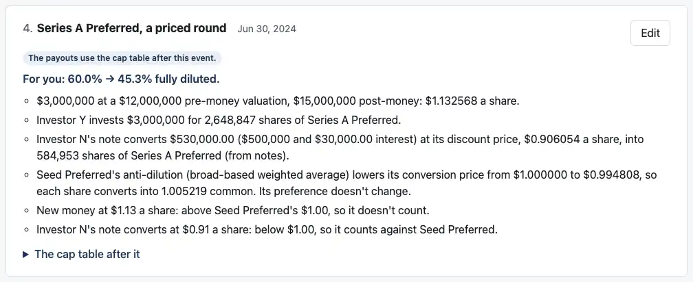
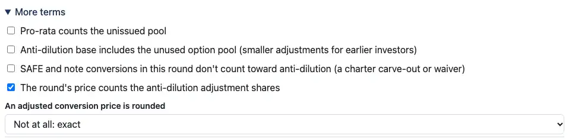
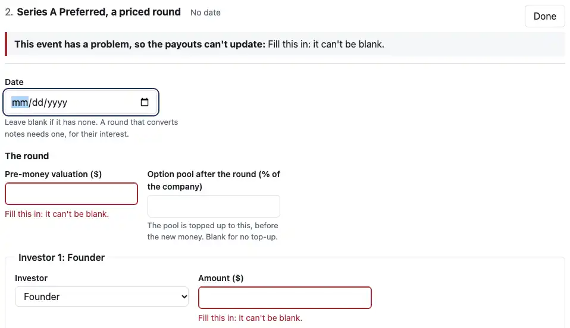

# Review: 03i (the page: the carve-out on the sale, anti-dilution pieces, the round settings, blanks at once)

Branch `03i-page`. The page work owed before 0.3.0:
- the carve-out as a term of the sale, in file version 5
- each anti-dilution piece in plain English, as you asked
- the two settings under "More terms", with your labels
- the blank-fields polish

The release is next, in 03j. No change to `cases/` or the engine.

## Each anti-dilution piece, one plain line each (your 03h answer)

Under a round's anti-dilution line, the Rounds tab now says what each piece did, in your wording. Case 16i:

The other forms, from the tests:
- **16j:** "Investor S's SAFE was issued before Seed Preferred, so it counts in the starting share count instead."
- **16h:** "Investor S's SAFE is exempt under this round's setting, so it counts in the starting share count instead."
- **A piece at exactly the conversion price** says "at", not "above". Nothing changes there (R25).

**Prices are to the cent, as in your examples.** The line above them keeps six places, as the rest of the summary does. One guard: where two places would make a piece's price look equal to the conversion price it's compared with, both get six places. So a line never says "$1.00: below $1.00".

## The round's settings under "More terms" (your 03h answer)

- **"Anti-dilution base includes the unused option pool (smaller adjustments for earlier investors)"** replaces "Broad-based anti-dilution counts the unissued pool in A". It shows only when an earlier series has broad-based anti-dilution.
- **"SAFE and note conversions in this round don't count toward anti-dilution (a charter carve-out or waiver)"** is the new setting. It shows only when both hold:
  - a SAFE or note converts in the round
  - an earlier series has anti-dilution
- **A setting that's on always shows,** even where it wouldn't apply, so a setting loaded from a file is never hidden while it's on.
- **The settings read the events as typed,** as the SAFEs and notes section does, so an earlier event the engine can't build yet doesn't hide them.

Tests open 16g, 16h and 16c as files and check each case: shown, hidden, and on.

## The carve-out as a term of the sale, file version 5 (your answer 1)

- **To the engine:** the page now gives the carve-out on the exit (`exit.carve_out`, read since 03e), for a cap table entered directly and for one built from rounds alike.
- **In a saved file:** it sits with the sale's terms: after `exit_date`, before `payment_schedules`. The file version is now **5**.
- **A version 4 file** with the carve-out in its cap table opens with it moved to the sale, and saves as version 5. A version 4 rounds file already kept it beside the rounds, and opens as it was.
- **A carve-out beside a cap table entered directly** opens now. Version 4 refused it.
- **One in both places** is refused in the engine's words: "Its cap table can't be used. file.carve_out: the carve-out is on both the cap table and the exit; give it once".

The Exit terms card itself is unchanged.

## Blank fields, all at once (M4 review's polish item)

A new priced round now marks both its pre-money valuation and its investment as blank, where it used to mark one at a time.

**How:** the engine names one problem at a time. Many blank fields are fine, though: no cap, or no pool top-up. So the page doesn't guess which blanks matter.
1. When the engine names a blank, the page fills it with a stand-in, in a copy only it sees.
2. It asks the engine again, and repeats while the engine names another blank in the same event.

Every field marked is one the engine itself says can't be blank. The pool target above stays unmarked: blank means no top-up. The stand-ins are never shown or saved.

**Small enough to include.** It's one function, in `roundsDraft.ts`, and a few lines where the editor marks fields.

## How to check it by behavior

1. **The pieces:** open a version 5 file holding 16i's holders and events, or look at the shot above. `openCase` in `test/rounds-editor.test.tsx` builds one.
2. **The settings:** on Millrace's Rounds tab, Edit Series B and open "More terms".
   - Millrace's Series A has broad-based anti-dilution, so the pool setting shows, with the new label.
   - No SAFE converts in the Series B (Millrace's SAFEs converted in the Seed), so the exemption setting doesn't.
3. **The file version:** on Cap table, add a carve-out (Exit terms) and Save. The file says `"version": 5`, with `carve_out` after `range`.
4. **The blanks:** Start from a blank company built from rounds, then on Rounds add "A priced round". Both blank fields are marked at once.

## Decisions I made, for you to check

1. **The series' own name in the lines.** They say "Seed Preferred" where your examples said "the Seed", and "counts against Seed Preferred".
2. **A setting that's on is shown even where it doesn't apply,** so nothing hidden can change an answer.
3. **"Earlier series" means series issued before this round, as typed.** The round's own new series doesn't count: its settings can't adjust it in its own round.

## Also in this PR

- **`docs/ASSUMPTIONS.md`:** C6 (the carve-out on the page) and C13 (file version 5).
- **`notes/release-0.3.0.md`:**
  - **The page section.**
  - **Under API changes, as you asked:**
    - the new refusal name, `discounted_conversion_in_anti_dilution_a`, and the narrower meaning of `anti_dilution_with_conversions`
    - the four refusals 0.2.0 raised that 0.3.0 no longer does
- **`scripts/screenshots.mjs`:** three 03i shots, 63 KB. They open a locked case as a file, inside the page.

## The tests

- **Dashboard:** **318 tests pass**, 8 more.
  - **The format tests:** updated for version 5.
  - **New:** a direct cap table's carve-out on the sale; the version 4 migration; both places refused; the pieces for 16i, 16j and 16h; the settings for 16g, 16h and 16c; blanks at once.
- **Engine:** 1,485 tests pass, unchanged.
- **Reference:** 55 unit tests pass, and all 75 cases match.
- **Typecheck and build:** clean.

## CI and permissions

- **No changes** to `.github/workflows/` or `.claude/`.
- **Outside the sandbox:** only `pnpm screenshots`, under your standing permission. The preview server ran inside it.

## Assumptions added

**No new IDs.** C6 and C13 updated.

## Open questions

None. Next is 03j: release 0.3.0.
- **What it does:** the version bump, the release notes finished, and the README examples run as a check.
- **What it doesn't:** publish. You publish.

I'm stopping here.
