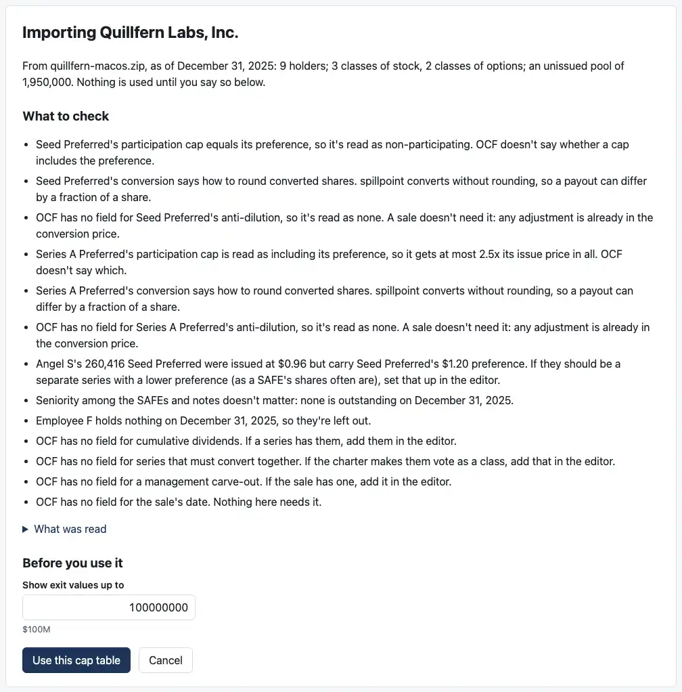
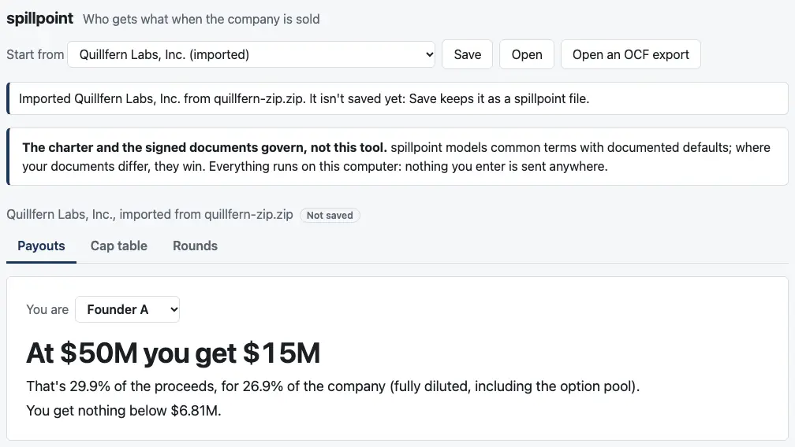
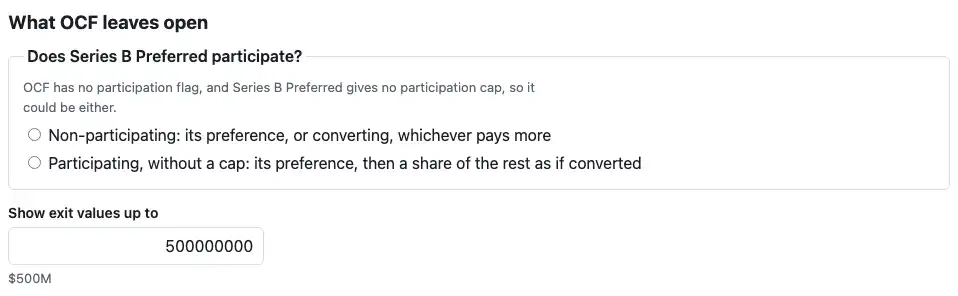
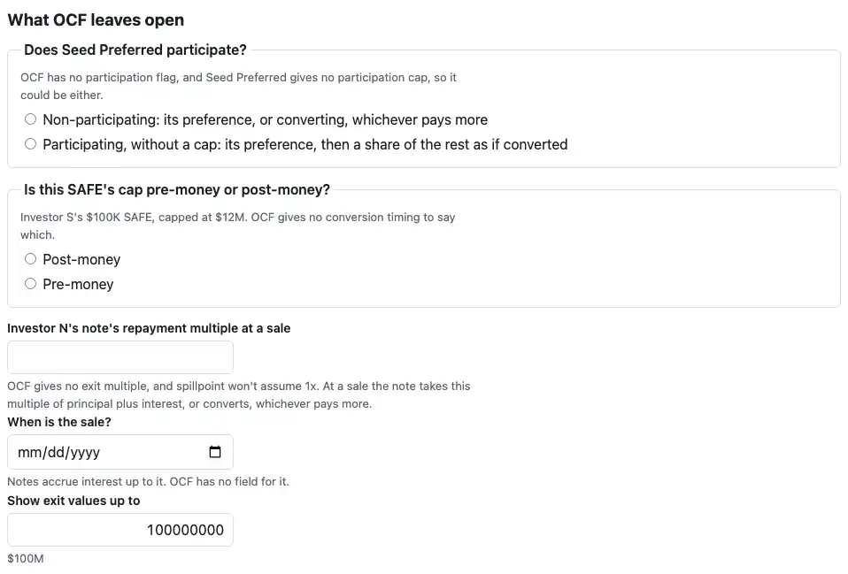
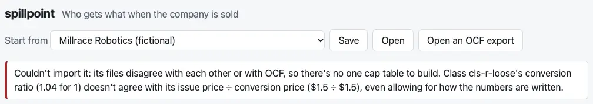

# Review: 04f (the page opens an OCF export)

Branch `04f-ocf-page`, two commits:
1. **Your three engine changes from the 04e review.**
2. **The page:** "Open an OCF export" takes a .zip or a package's loose .json files. It shows the import's report first, asks for each term OCF leaves open, and then opens the cap table as a saved file would.

`cases/` is untouched.

## 1. The engine changes

- **Convertible seniority** is refused only when the SAFEs and notes still outstanding differ. The report line stays as it was.
- **A warrant's mechanism is checked only if the warrant is still outstanding,** as for SAFEs and notes. Structural problems are still refused: a quantity that disagrees with its conversion's, or a class that isn't in the package. One edge: an unreadable warrant that gives no quantity, partly cancelled or transferred without a balance security, can't be followed, so it's refused.
- **A plan with no cancellation behavior** stays refused for 0.4.0. It's on the later list and the 1.0c watch list, with the likely fix you gave: the question "Do cancelled grants under [plan] go back to the pool?"

Each has a test, and O7, O8 and the later list say so.

## 2. The page

### How to check it

Run `pnpm dev`, then click **Open an OCF export**, at the top beside Open.

1. **Quillfern from a zip.** Choose `apps/dashboard/test/fixtures/quillfern-zip.zip`, or the `-macos` or `-windows` one beside it. The report comes first, and nothing is used until you say so:

   

   - **The line for Angel S's shares** is in your words: "Angel S's 260,416 Seed Preferred were issued at $0.96 but carry Seed Preferred's $1.20 preference. If they should be a separate series with a lower preference (as a SAFE's shares often are), set that up in the editor."
   - **"What was read"** opens the counts by object type: what was read, and what was set aside.
   - **Use this cap table** opens it. It's marked not saved, and Save keeps it as a spillpoint file:

   

2. **Millrace, as loose files.** Choose all eight files in `cases/ocf-11-millrace/package`. Series B's participation is asked. Use isn't taken until you answer:

   

3. **The SAFE question.** Choose Larkspur's eight files (`cases/ocf-01-larkspur/package`) with `cases/ocf-04-to-fill/fixtures/safe-cap-without-timing.ocf.json`. The SAFE is asked, in your words, "Is this SAFE's cap pre-money or post-money?", beside:
   - Seed's participation
   - the note's repayment multiple
   - the sale's date, which notes need

   

   Answer them all and click Use: the engine refuses Larkspur's SAFEs beside a note at a sale (X12). The report stays, with the engine's message.
4. **A refusal.** Choose Larkspur's files with any of case 03's fixtures, say `conversion-ratio-loose.ocf.json`. The page says why, and keeps the cap table you had:

   

**The tests** (`pnpm test`) click the same things through:
- **Quillfern from each of the three zips** is reported, used, saved and opened again. It pays as edge case 25 does, to the cent, at every breakpoint.
- **Millrace's question** has to be answered before Use works, and Series B saves as participating.
- **Larkspur with the SAFE fixture** asks the SAFE question, and Use shows the engine's refusal in the panel.
- **A refused package** shows its message, and Cancel goes back.
- **The zip reader:**
  - each zip holds the package's files byte for byte, once macOS's resource fork is set aside
  - another compression method, an encrypted entry and a damaged entry are each refused by name
  - a file that isn't a zip, or a zip picked with loose files, is refused

**The three test zips** (`apps/dashboard/test/fixtures/`, described in its README):
- **macOS:** made by `ditto`, as Finder's Compress makes one. It carries a `__MACOSX` resource fork, and sizes kept only in the zip's directory.
- **The zip command:** made by `zip`.
- **Windows: synthesized.** It's written as Windows' `Compress-Archive` writes one, with "\" between folders, since this Mac can't run Windows. If you can make a zip on Windows, it can replace this one.

## Decisions for you to check (new, O13 in ASSUMPTIONS)

1. **A button of its own,** "Open an OCF export", beside Open, rather than one Open for both. An import has a step a saved file doesn't: the report and the questions.
2. **What a zip may hold:**
   - stored and deflated entries only; any other method, encryption, Zip64 or a split zip is refused by name, and an entry that fails its checksum is refused as damaged
   - macOS's `__MACOSX`, `._` and `.DS_Store` files are set aside
   - any other file that isn't JSON is listed as not read

   OCF packages can carry documents, which aren't part of the cap table.
3. **The sale's date** is asked only when a note is outstanding, since notes accrue interest to it.
4. **How far up the exit values go.** The default is ten times what comes ahead of common at a sale, rounded up to 1, 2 or 5 of a power of ten, and at least $10M:
   - each series' issue price × its multiple × its shares
   - each SAFE's purchase amount
   - each note's principal

   It's in the panel, and the editor can change it later. Quillfern gets $100M; Millrace, $500M.
5. **Your other-price line** gives the preference a share as the issue price × the multiple. Your example was 1x, where that's the issue price. At 1.5x it says the larger amount, which is what the shares carry.
6. **An import isn't saved until you save it.** It's marked "Not saved", and leaving the page asks first.
7. **The report's other lines** are mine, one for each note code. Tell me any you'd word differently.
8. **Browsers:** a zip needs the browser's DecompressionStream for deflate, which means Chrome 103, Safari 16.4 or Firefox 113 or later. Loose files work in any browser.

## Checks

- **Engine:** 1,789 tests pass.
- **Dashboard:** 340 tests pass, 18 more.
- **Typecheck:** clean.
- **The page builds.**

## CI and permissions

- **No changes** to `.github/workflows/` or `.claude/`.
- **Outside the sandbox:** only `pnpm screenshots`, under your standing permission. The preview server ran inside it.
- **The screenshot script** (`apps/dashboard/scripts/screenshots.mjs`, a dev tool) gets five 04f shots. Its wait for the page also accepts the import's report, which stands in for the payouts until it's used.

## Open questions

The decisions above, and whether you can make a Windows zip. Next is 04g, the 0.4.0 release. I'm stopping here.
