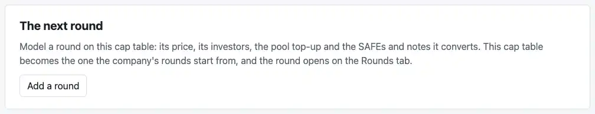
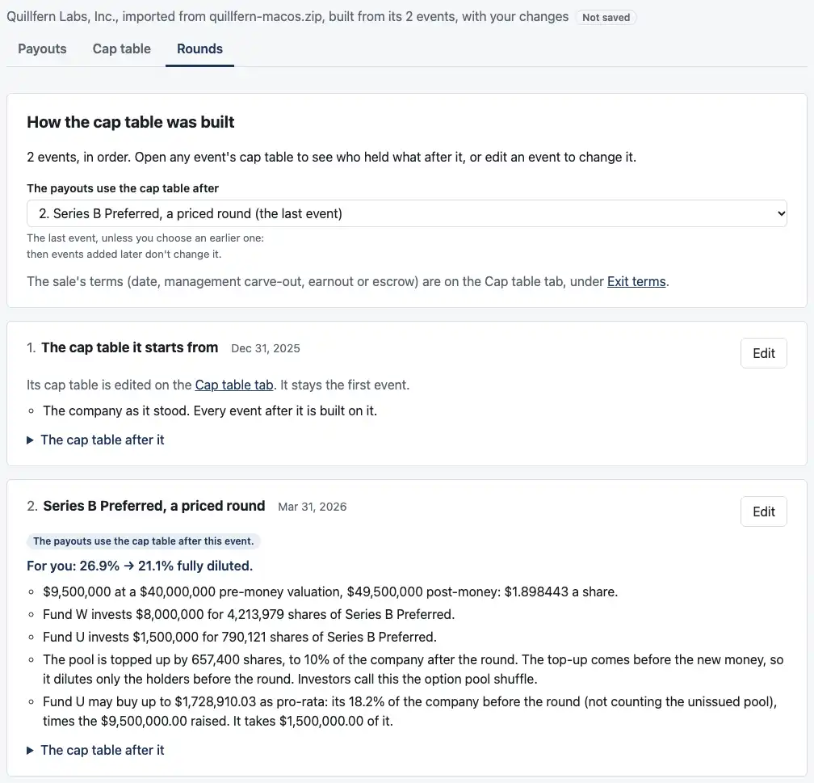
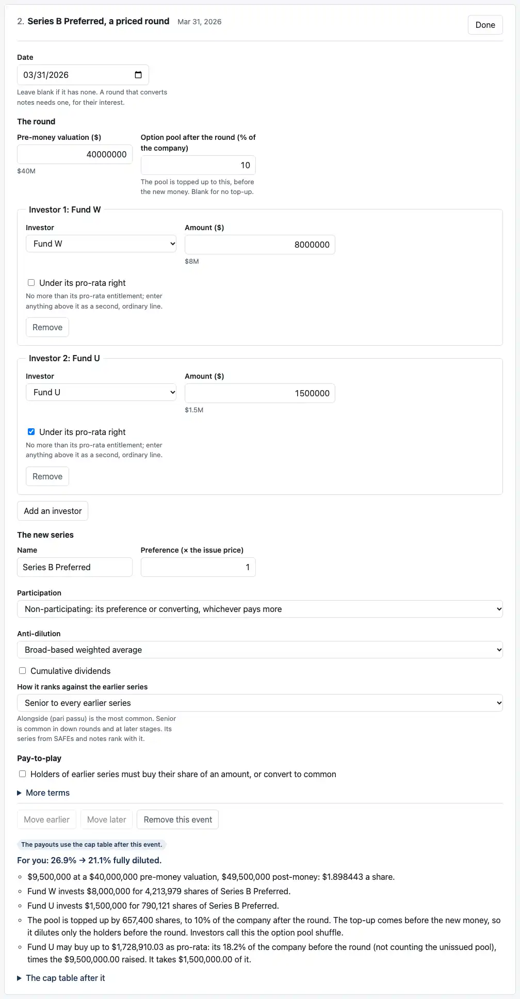
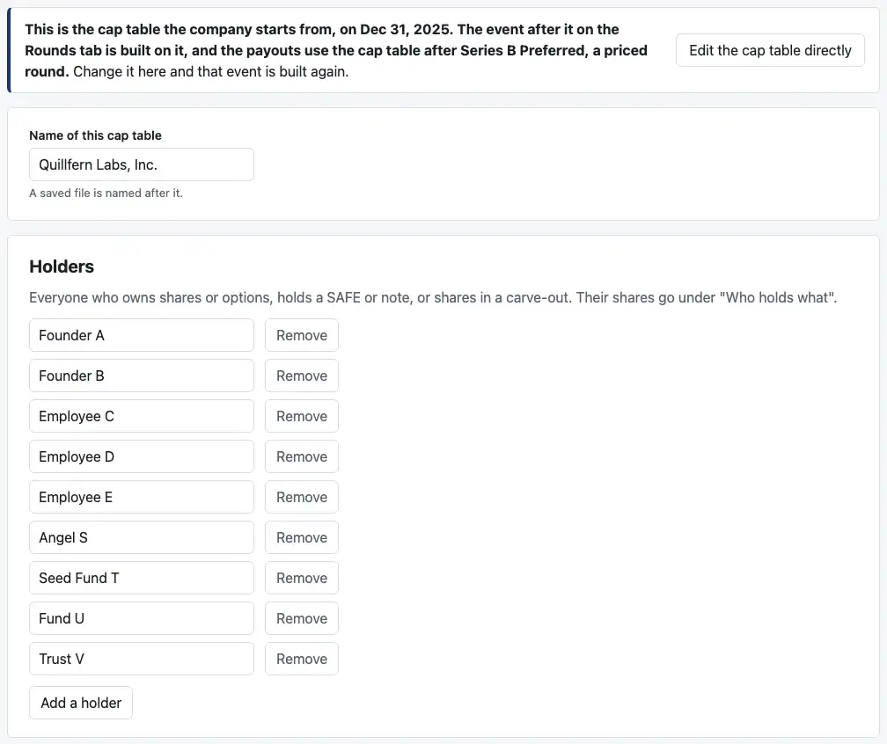
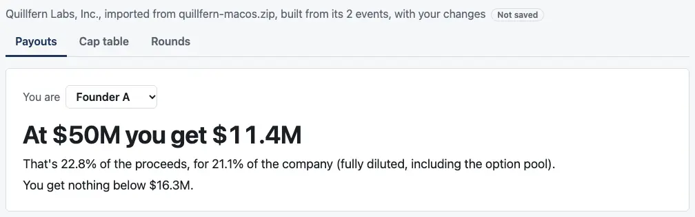

# Review: 05b3a ("Add a round")

Branch `05b3-add-a-round`. Nothing in `cases/` changes. It has three commits:
1. **Your 05b2 answers** in the plan and ASSUMPTIONS, and 05b3 split in two.
2. **"Add a round" on the page,** with saved files at version 6 and conversion groups carried through.
3. **The docs, the screenshots and this note.**

**05b3 is split to fit an evening each.** This is 05b3a. 05b3b is what a round says about a starting table:
- an imported series with no anti-dilution, in a down round
- your conversion group sentence
- how the issue order was read

## What you can do now

**"Add a round"** is on the Cap table tab of any cap table entered directly or imported, under "The next round". It's also on the Rounds tab when there are no rounds.



**It opens the Rounds tab.**
- The table becomes "1. The cap table it starts from". An import's is dated as of the export, Dec 31, 2025 for Quillfern.
- After it comes a new priced round, open to fill in. Quillfern has a Series A, so it's "Series B Preferred".
- Holders added on the Rounds tab, such as Fund W, can invest in it.



**The round's form is the one rounds always had.** Here it holds case 26's Series B.



**The Cap table tab now edits the starting table,** and the rounds after it are built again on every change. Its holders are the starting table's, renamed and removed there. "Edit the cap table directly" still drops the rounds, and keeps the table the payouts use.



**The payouts use the table after the last event.** At $50M, Founder A gets $11.4M: case 26's $11,416,440.91.



**Save** writes version 6: the starting table as the first event, with the import's issue order. Opening the file gives the same company back.

## How to check by behavior

1. **Run the tests:**
   ```bash
   pnpm test
   ```
   - **Dashboard:** 435 pass, 12 more.
   - **Engine:** 2,048 pass, unchanged.

   The one to look at is `apps/dashboard/test/add-a-round.test.tsx`. It imports Quillfern, types case 26's Series B through the page, saves, and checks the file against case 26's locked expected values: every breakpoint, and every holder's payout there, to the cent. Then it opens the file and checks again.
2. **Or click through it** with `pnpm dev`:
   1. **Import it:** "Open an OCF export", choose `apps/dashboard/test/fixtures/quillfern-macos.zip`, then "Use this cap table".
   2. **Add the round:** Cap table tab, "Add a round".
   3. **On the Rounds tab:** under Holders, "Add a holder", and name them Fund W.
   4. **In the Series B form:**
      - **Date:** 2026-03-31
      - **Pre-money valuation:** 40000000
      - **Option pool after the round:** 10
      - **Investor 1:** Fund W, 8000000
      - **"Add an investor":** Fund U, 1500000, ticked "Under its pro-rata right"
      - **How it ranks:** "Senior to every earlier series"
   5. **Payouts tab:** $11.4M for Founder A at $50M. The breakpoint list has case 26's nine breakpoints, from $9,499,997.97 to $58,471,498.00.
   6. **Starting table:** on the Cap table tab, give Fund U 4,000,000 Series A. On the Rounds tab, its pro-rata grows to about $2.13M.
3. **A version 5 file still opens,** and saves again as version 6, otherwise the same (`test/file.test.ts`).
4. **A grant at an imported option class's strike joins that class** (your extra test). A grant of 1,000 at $0.10 after Quillfern's start adds to `options_0.1`: 201,000, and no new class.

## Decisions for you to check (R31, C13)

1. **Where "Add a round" lives:** a card on the Cap table tab, and the Rounds tab of a table with no rounds.
2. **The starting table's date and order:**
   - **From an import,** its date and issue order.
   - **From a table entered directly,** neither, so the default holds.
   - **They're kept only while the table is still the import's.** "Edit the cap table directly" drops them with the rounds.
   - **A cap table saved without rounds doesn't keep them.** It has no field for them, so an import saved and reopened before adding a round starts with the default order. Say if you'd like the file to keep them.
3. **The order, kept to the table as you edit it:**
   - a series taken out drops out
   - a series added counts as issued before every SAFE and note
   - a SAFE or note added counts as issued after everything

   That's the engine's own default.
4. **The starting table stays first.**
   - It can't be moved or removed, and nothing moves above it.
   - Dropping it is "Edit the cap table directly", which asks first, in these words: "The cap table the payouts use, after Series B Preferred, a priced round, stays exactly as it is now, and you edit it here in place of the one the company starts from."
5. **The new round's series letter:** the later of two, so Millrace and the other examples get the letter they got before:
   - the one after the last "Series" letter the company has
   - today's rule, one letter per priced round
6. **On the Rounds tab:**
   - The starting table's holders are listed under Holders without a name box, with a line saying to rename them on the Cap table tab.
   - Its card has no "For you" line, since it has no before.
7. **A starting table in a saved file** is written as the cap table editor writes one: shares as strings, and no conversion price when it equals the issue price. The engine reads it as the same table. The round-trip test compares cases 26 and 27 that way, and every other round case exactly, as before.

## Fixed along the way

- **Conversion groups:** the page wrote every built table back with none. Now a starting table's group stays through its rounds (a test on edge case 6b's group).
- **A starting table's SAFEs and notes** now count in the round's "SAFEs and notes" section and the at-sale lines. The test of SAFEs and notes in round cases no longer leaves out cases 26 and 27.

## Open question

**Larkspur still can't reach "Add a round" on the page.** Its SAFEs sit beside a note, which a sale refuses until 05c, and the import review won't use a table the sale refuses. So case 27's flow, import then a round that converts them, waits for 05c.

I could add a "Use it to add a round" button to the import review for a table only the sale refuses. Should that go into 05b3b, or wait for 05c?

## Assumptions added or changed

- **R31:** "Settled in 05b3a", covering the decisions above.
- **C13:** saved files version 6.
- **The later list:** a round's new series joining a starting table's conversion group (your 05b2 answer).
- **The plan:**
  - the 05b3 split and your two additions
  - the `readInputs` fix, under changed behavior in 0.5.0's release notes

## Checks

- **Dashboard:** 435 tests pass.
- **Engine:** 2,048 tests pass.
- **Typecheck:** clean.

## CI and permissions

- **No changes** to `.github/workflows/` or `.claude/`.
- **The screenshot script** (`apps/dashboard/scripts/screenshots.mjs`) gains five shots, `05b3a-*`.
- **One mistake:** I ran the page's build outside the sandbox once, chained in the same command as a screenshot. Only `pnpm screenshots` should run there. Nothing else did, and the build itself only writes `apps/dashboard/dist`.

## Next

05b3b: what a round says about a starting table. I'm stopping here.
