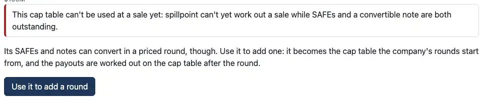
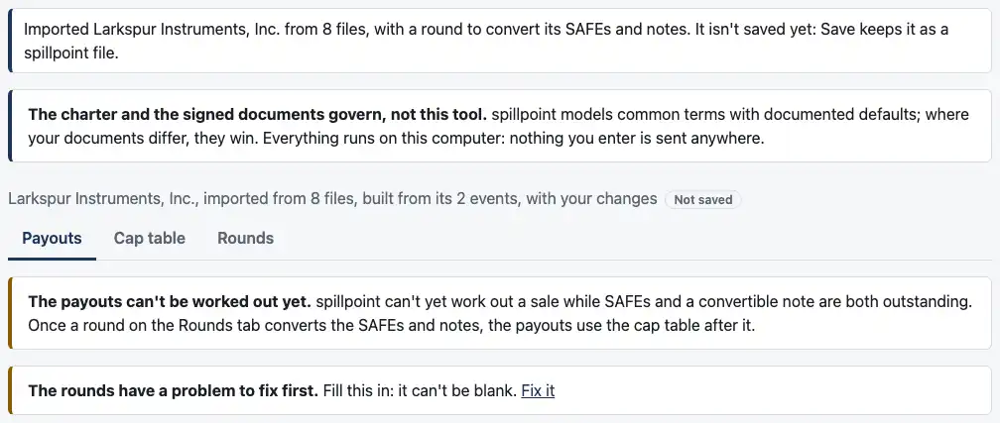
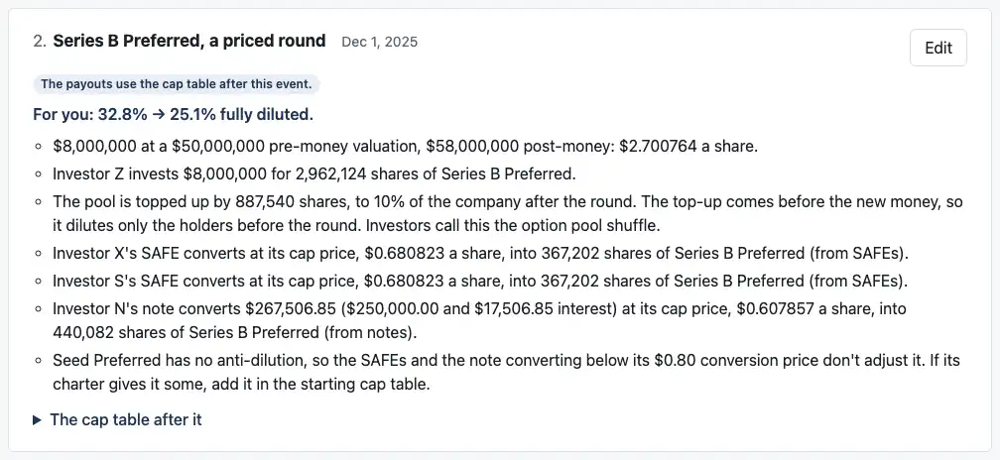
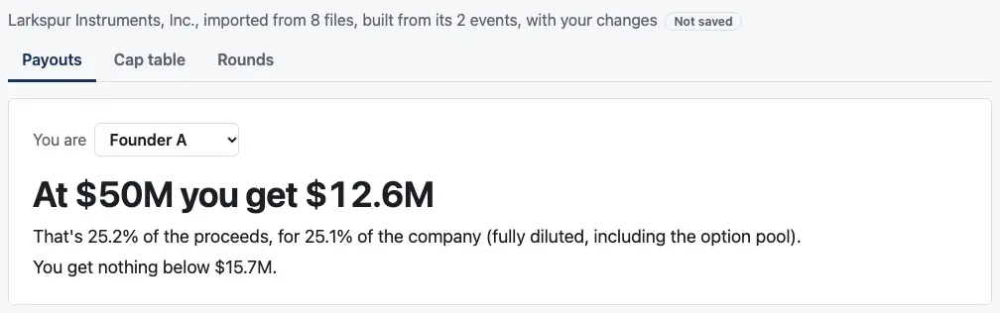
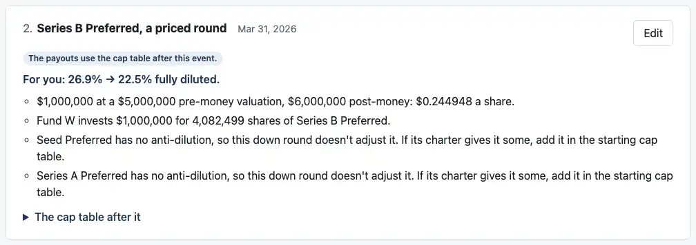
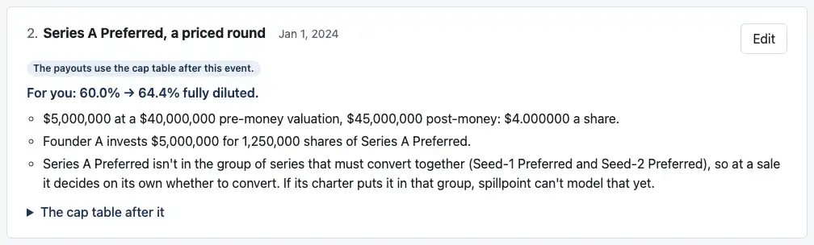

# Review: 05b3b (what a round says about a starting table, and Larkspur)

Branch `05b3b-round-notes`. Nothing in `cases/` changes. It has four commits:
1. **Your answers** in the plan.
2. **The page.**
3. **The docs, the screenshot steps and this note.**
4. **Your review answers and the screenshots,** added after your first look (below).

## 1. "Use it to add a round" (your answer 2)

**When it's offered:** the engine refuses a table at "Use this cap table" only for the limits a sale puts on SAFEs and notes still outstanding. Each term has its own sentence, in plain words (your review, answer 2):

| The engine's term | What the page says |
|---|---|
| `note_with_safe_or_carve_out` | "spillpoint can't yet work out a sale while SAFEs and a convertible note are both outstanding." It reads "a SAFE" and "convertible notes" by count. With a carve-out beside a note and no SAFE: "spillpoint can't yet work out a sale with a management carve-out while a convertible note is outstanding." |
| `pre_money_safe_with_preferred` | "spillpoint can't yet work out a sale while a pre-money SAFE is outstanding beside preferred stock." |
| `several_safes` | "spillpoint can't yet work out a sale while several SAFEs are outstanding, unless each has a post-money valuation cap." |
| `several_notes` | "spillpoint can't yet work out a sale while several convertible notes are outstanding, unless each has a valuation cap." |

Larkspur's offer:



Any other refusal reads as before, with no offer. A test pins one: a sale dated before a note was issued.

**What it does:** the table becomes the starting table, dated and ordered as the import was, and the Rounds tab opens at a Series B. Both "Converts the SAFEs still outstanding" and "Converts the convertible notes still outstanding" are ticked.

**Until a round converts them,** the Payouts tab says why, in the same words. Below it is any problem with the round as typed, with its "Fix it". This is new: until now the page always had a table it could pay out.



**Once the round is typed in,** case 27's Series B pays out:





**The main test** is in `apps/dashboard/test/add-a-round.test.tsx`:
1. It imports Larkspur and answers its two blanks as case 27 fills them, with a sale date.
2. It uses it to add a round, and enters case 27's Series B through the page: Investor Z, added on the Rounds tab, $8M at $50M pre-money, the pool to 10%, senior.
3. It saves, and checks the file against case 27's locked expected values: every breakpoint, and every holder's payout there, to the cent. Holders are matched by name, since the page gives Investor Z its own id.
4. It opens the file and checks again.

It passes. It takes 9.5s here and runs full searches on case 27, so it has the 60-second timeout from #68.

## 2. A saved cap table keeps the import's date and issue order (your answer 1)

An imported table saved before a round is added writes them beside the cap table, each only when present:

```json
{ "format": "spillpoint", "version": 6, "name": "…", "cap_table": {…}, "as_of": "2025-12-31", "issue_order": ["seed", "series_a"], "range": […] }
```

**When it's reopened,** "Add a round" starts from the same date and order. A test saves Quillfern, reopens it, adds a round and saves again: the start event has Dec 31, 2025 and `["seed", "series_a"]`.

**Refused:**
- a date or an order the page can't read
- either one beside rounds, which keep them in their first event

## 3. What a round says about a starting table

Each note is tested on the engine's own build, as the Rounds tab shows it (`apps/dashboard/test/round-notes.test.ts`).

### A starting series with no anti-dilution

**When the note shows** (your review, answer 1): whenever the round would adjust the series if it had broad-based anti-dilution:
- **the round's price is below its conversion price,** or
- **a SAFE or note converts below its conversion price and would count against it under R25.** That means one issued after the series, by the order, in a round that doesn't exempt its conversions.

**In a down round,** Quillfern with a $5M pre-money Series B, about $0.25 a share, gives:



**When only conversions are below it,** the note names what converts: the SAFE, the note, or both, singular or plural. Case 27, an up round at $2.70, converts its note at $0.61 and its SAFEs at $0.68:
- **The Seed ($0.80):** the note and SAFEs were issued after it, so the note fires: "Seed Preferred has no anti-dilution, so the SAFEs and the note converting below its $0.80 conversion price don't adjust it. If its charter gives it some, add it in the starting cap table."
- **Series A ($2.00):** they were issued before it, by Larkspur's order, so no note.

That's in the Larkspur screenshot above. The tests on case 27 also cover:
- **No order given:** Series A gets the note too, since the SAFEs and the note then count as issued after both series.
- **Only the note converts:** "…so the note converting below its $0.80 conversion price doesn't adjust it…"
- **Conversions exempted:** nothing.

**A conversion price is shown to the cent when that's exact** ($0.80, $2.00), and to six places otherwise.

### A conversion group in the starting table

In your wording. Case 6b's two Seed series, typed in, with a Series A:



With a SAFE in the starting table that the round converts, the plural reads:

> Series A Preferred and Series A Preferred (from SAFEs) aren't in the group of series that must convert together (Seed-1 Preferred and Seed-2 Preferred), so at a sale each decides on its own whether to convert. If the charter puts them in that group, spillpoint can't model that yet.

### How the issue order was read

**When it shows:** a round adjusts a starting series, and a SAFE or note from the starting table converts in it. It's the last line under the adjustment, after each piece's line. Case 16j from the table after its Seed, with its down Series A, shows both readings:
- **As the starting table gives it,** in your wording (review answer 3): "Whether each SAFE and note was issued before or after Seed Preferred comes from the starting cap table." The note's and the SAFE's lines then say each "was issued before Seed Preferred, so it counts in the starting share count instead."
- **With none given,** as before: "The starting cap table doesn't give the order things were issued in, so its SAFEs and notes count as issued after Seed Preferred: they usually bridge to the next round." Their lines then say they count against it.

## How to check by behavior

1. **Run the tests:**
   ```bash
   pnpm test
   ```
   - **Dashboard:** 458 pass, 23 more than main.
   - **Engine:** 2,048 pass, unchanged.
2. **Or click through it** with `pnpm dev`:
   1. **Import Larkspur:** "Open an OCF export", choose the eight files in `cases/ocf-01-larkspur/package`.
   2. **Answer its questions:**
      - Seed Preferred: non-participating
      - Investor N's repayment multiple: 1
      - a sale date
   3. **"Use this cap table",** then "Use it to add a round". The Payouts tab says why it can't pay out yet.
   4. **On the Rounds tab:** add Investor Z under Holders.
   5. **In the Series B form:**
      - **Date:** 2025-12-01
      - **Pre-money valuation:** 50000000
      - **Option pool after the round:** 10
      - **Investor 1:** Investor Z, 8000000
      - **How it ranks:** "Senior to every earlier series"
   6. **The Rounds tab** shows the Seed's note.
   7. **The Payouts tab** shows case 27's payouts. At $50M, the middle of the import's range, Founder A gets $12.6M: Investor Z's Series B still takes its $7,999,998.61 there, and common is $2.329379 a share.
3. **For the down-round notes:** import Quillfern, "Add a round", and give it a $5M pre-money.

## Your review, applied

1. **The no-anti-dilution note, widened** to conversions that would count under R25, naming what converts, with a test on case 27.
2. **Plain words for the four at-a-sale refusals,** on the offer and the Payouts tab (`apps/dashboard/src/saleLimits.ts`, with a test for each).
3. **The order line,** in your wording.
4. **The other decisions,** agreed, are unchanged:
   - the plural group sentence
   - where the order line goes
   - the Payouts tab's lead-in
   - Save waiting for a payable table
5. **The screenshots,** above.

## Assumptions added or changed

- **R31:** "Settled in 05b3b".
  - the offer, and the Payouts tab before a round converts, in plain words
  - the three notes in their exact words, the no-anti-dilution one widened to conversions
  - a saved cap table now keeps the import's date and order
- **C13:** version 6's `as_of` and `issue_order` beside a cap table entered directly.

## Checks

- **Dashboard:** 458 tests pass.
- **Engine:** 2,048 tests pass.
- **Reference:** passes, unchanged.
- **Typecheck:** clean.

## CI and permissions

- **No changes** to `.github/workflows/` or `.claude/`.
- **The screenshot script:**
  - It gains six `05b3b-*` shots.
  - It also counts a page as finished when the Payouts tab shows the no-payouts notice, since that state has no headline.
- **Where things ran:**
  - inside the sandbox: the page's build and preview server
  - outside it: only `pnpm screenshots`

## Next

0.5.0 continues with 05c: SAFEs beside a note at a sale. I'm stopping here.
