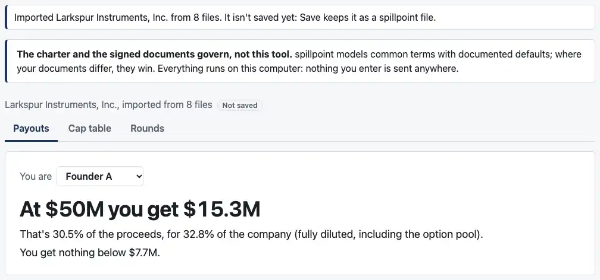
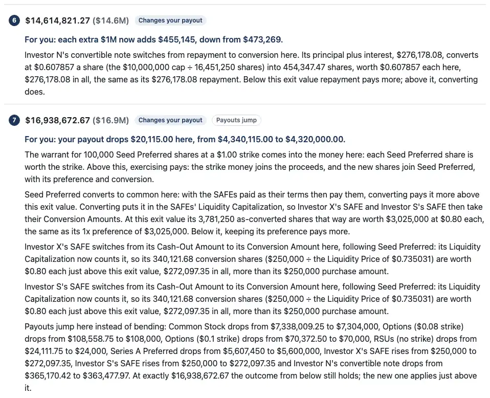

# Review: 05c2 (the engine follows X18 and E20)

Branch `05c2-engine-safes-beside-a-note`. The `cases/` edit rule is back on: no case file changed. It has four commits:
1. **The engine: SAFEs beside a note (X18), and the SAFEs' greater-of last (E20).**
2. **The OCF import reads the note-base rule (O9).**
3. **The page:** Larkspur opens at a sale, and the sale-limit wording.
4. **The docs, the screenshots and this note.**

## 1. SAFEs beside a note at a sale (X18)

**What's lifted:** `note_with_safe_or_carve_out`, for a note with a cap beside SAFEs with post-money caps, as in the reference.
- **The note's repayment is debt,** paid first. The engine already did this.
- **A converting note counts in a post-money SAFE's Liquidity Capitalization,** at its conversion shares. A note being repaid doesn't.
- **The note's base counts no SAFE.** The engine already did this.

**Still refused,** under the same term, so nothing that catches it breaks:
- a note with no cap beside a SAFE
- a SAFE with no post-money cap beside a note
- a note beside a carve-out, on the cap table or on the sale

## 2. E20 in the engine: the SAFEs' greater-of comes last

**The solver:**
- **The series, warrants and notes lead.** They're solved from both ends, as E15 says.
- **Each weighs a switch with the SAFEs re-settled after it.** The SAFEs take the greater of their two amounts given everyone else's choices, with options settled under each.

**The ties, as you confirmed:**
- **A SAFE converts only when that strictly pays more.**
- **A series or note that's indifferent keeps its preference or is repaid,** so the outcome from below holds at the jump.
- **Several SAFEs that could settle more than one way** take the fewest conversions.

**The breakpoint finder** now also follows each SAFE's gain from switching inside every switch a series, warrant or note weighs. Otherwise a SAFE settling differently there would bend that gain where the finder doesn't look.

**The jump's reasons,** at 12j's $16,559,391.30:
- **The Seed:** "Seed Preferred converts to common here: with the SAFEs paid as their terms then pay them, converting pays it more above this exit value. Converting puts it in the SAFEs' Liquidity Capitalization, so Investor X's SAFE and Investor S's SAFE then take their Conversion Amounts. At this exit value its 3,781,250 as-converted shares that way are worth $3,025,000 at $0.80 each, the same as its 1x preference of $3,025,000. Below it, keeping its preference pays more."
- **Each SAFE:** "Investor X's SAFE switches from its Cash-Out Amount to its Conversion Amount here, following Seed Preferred: its Liquidity Capitalization now counts it, so its 330,244.57 conversion shares ($250,000 ÷ the Liquidity Price of $0.757015) are worth $0.80 each just above this exit value, $264,195.65 in all, more than its $250,000 purchase amount."
  - **Before this,** the engine would have said that $264,195.65 was "the same as its purchase amount."
- **13i's note** gets a closing sentence where it converts: "Converting adds its shares to the Liquidity Capitalization Investor S's SAFE converts on, so its conversion shares grow with it: just above this exit value its payout jumps up and common's down."

**The fix for 0.5.0's release notes** is in the plan's 05e section. 0.4.0's search stopped on 12j at $16,531,000 with "went round in a circle (E15)". I ran main's engine to confirm it.

## 3. Found along the way: two equal SAFEs

E20's fewest-conversions tie changes one thing outside the locked cases.

**The table:** two equal post-money SAFEs, $250,000 each at a $2,000,000 cap, beside 1,000,000 common.
- **From $2,000,000 to $2,250,000** both taking cash and both converting are each stable.
- **0.4.0's `solve` reported both answers there.** Its breakpoint search happened not to look inside that range.
- **Now** the SAFEs take cash until one gains by converting alone, at $2,250,000, and payouts jump there. The reference agrees.

**The jump's wording was wrong in 0.4.0 too:** it called each SAFE's $281,250 "the same as its purchase amount". It now reads: "Investor A's SAFE switches from its Cash-Out Amount to its Conversion Amount here, with Investor B's SAFE. Converting on its own, its 142,857.14 conversion shares ($250,000 ÷ the Liquidity Price of $1.75) would be worth $1.75 each, $250,000 in all, the same as its purchase amount; above this exit value, converting pays more. With the other SAFE converting too, the Liquidity Capitalization counts its shares, so its 166,666.67 shares are worth $1.6875 each just above this exit value, $281,250 in all."

**Where it's recorded:**
- an engine test pins it
- E20 records it
- the plan lists it under 0.5.0's changed behavior

## 4. The note-base rule in the OCF import (O9)

**A note whose capitalization rules count other converting securities:**
- **Refused as `note_base_counts_other_convertibles`** (subject: its issuance), when another SAFE or note is outstanding on the package's date.
- **Otherwise read** from the rest of its rules, with the report line `note_base_other_convertibles_ignored`. On the page: "Fund U's note counts other SAFEs and notes in the shares its cap divides by. None is outstanding beside it, so that changes nothing."

OCF case 13 and case 03's new fixture pass.

## 5. The page

**Larkspur opens at a sale:** "Use this cap table" now gives payouts, not the offer of a round.
- **The case 27 page test** goes through the Cap table tab's "Add a round". A new round already converts the SAFEs and notes, so it pays as case 27 does at every breakpoint, saved and opened again.
- **"Use it to add a round" is still tested,** on Larkspur with the third SAFE from case 04's fixture answered as pre-money. That's a pre-money SAFE beside preferred, which a sale still refuses.

**The sale-limit sentence** now names which setup isn't modeled:
- "…while SAFEs are outstanding beside a convertible note with no valuation cap."
- "…while a convertible note is outstanding beside a SAFE with no post-money valuation cap."
- **With the SAFEs and notes all as modeled,** the limit must be the carve-out, which may be on the sale, so it names that.

**The OCF check's tests share the engine's runs.** About 20 fixtures fill to Larkspur's table, and each set of answers is now a full breakpoint search there. `checkExport` takes an optional cache of runs by filled table. The script never repeats a table, so it changes nothing there; the leak tests pass one shared cache. The file takes 42s here. Its slowest test takes 18s and has the 60-second timeout.

**The screenshot scenes** for 05b3b's offer now use the pre-money SAFE, since Larkspur no longer gets the offer. The images in 05b3b's note are kept as they were.

## 6. Speed

The SAFEs now re-settle under each switch the solver weighs. So on a table with SAFEs it weighs nearly every combination: 56 of 64 at each reading for 13j.

**One saving:** the option settling now reuses the payouts it has already worked out, with every answer the same. Times on this laptop:

| | main (0.4.0) | 05c2 |
|---|---:|---:|
| 12j | stops, 0.4s | 0.9s |
| 13j | refused | 2.4s |
| case 27 | 1.7s | 1.2s |
| Millrace | 0.36s | 0.25s |

**Tests:** those that search 12j or 13j in full have the 60-second timeout. It's in ASSUMPTIONS' later list beside case 27's figures.

## How to check by behavior

1. **Run the engine's tests:**
   ```bash
   pnpm test
   ```
   12j, 13i and 13j now run as exit cases:
   - every listed exit value and breakpoint, to the cent
   - the decisions, the reasons and the jump flags
   - OCF case 13 and the refused fixture against their expected results

   `packages/engine/test/safes-last.test.ts` has your $16,545,000 check: the Seed keeps $2,925,000, and converting would pay $2,921,654.22.
2. **Print 12j's breakpoints and reasons:**
   ```bash
   pnpm breakpoints edge-12j-larkspur-safes-at-a-sale
   ```
   It says "All match expected.json".
3. **On the page:**
   - Open an OCF export, and pick every file in `cases/ocf-01-larkspur/package/`.
   - Answer Non-participating and a repayment multiple of 1, with a sale on Jun 30, 2026.
   - Click "Use this cap table". It opens with payouts: at $50M Founder A gets $15.3M.
   - In the breakpoint list, number 7, $16,938,672.67, is the jump. Your payout drops $20,115.00 there.

   

   

## Decisions for you to check

1. **The refusal's term stays `note_with_safe_or_carve_out`** for the setups still refused, with a narrower message. Renaming it would break anything that catches it, the page's list of sale limits among them.
2. **A series that's indifferent keeps its preference everywhere, not only where its choice moves the SAFEs.** That's what the reference does. Where nothing else moves, payouts are the same either way, so it changes no answer.
3. **The two equal SAFEs (section 3):** one answer, the cash, where 0.4.0 gave two. It's under changed behavior for 0.5.0's release notes.
4. **The OCF check's shared cache** (section 5), for the tests' time.
5. **The wording:**
   - the note-base report line
   - the two new sale-limit sentences
   - the jump's reasons in sections 2 and 3

## Assumptions added or changed

- **E20:** confirmed (05c1 review) and in the engine, with what its SAFEs' tie changes (section 3).
- **X18:** in the engine. What's still refused is the same term.
- **O9:** in the engine, with both codes named.
- **E15:** SAFEs follow rather than decide, since 05c2.
- **The later list:**
  - the search's speed, with 12j's and 13j's times
  - the discount-only SAFE beside a note, now refused in 05c2 rather than "unless 05c finds it simple"
- **The plan's 05e:**
  - the fix for 12j's stop
  - the two-SAFE change
  - what's new

## Open questions

1. **A locked case for two equal SAFEs?** For example 12k: the table in section 3, with the jump at $2,250,000. Today only an engine test pins it, and the reference agrees. It would need the cases label, in a PR of its own.
2. **Is 13j's 2.4s acceptable for 0.5.0?** The page runs the search in a worker and says it's working. Or would you rather I look for a faster way to weigh the SAFEs before the release?

## Checks

- **Engine:** 2,191 tests pass, including 9 new ones in `safes-last.test.ts`.
- **Page:** 470 tests pass.
- **Reference:** 63 unit tests pass, and every `expected.json` matches.
- **Typecheck:** clean.

## CI and permissions

- **No changes** to `.github/workflows/` or `.claude/`.
- **Outside the sandbox:** only `pnpm screenshots`. The build and the preview server ran inside it.

## Next

05e, release 0.5.0. I'm stopping here.
