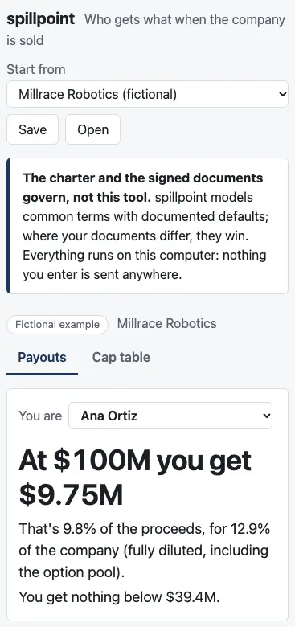
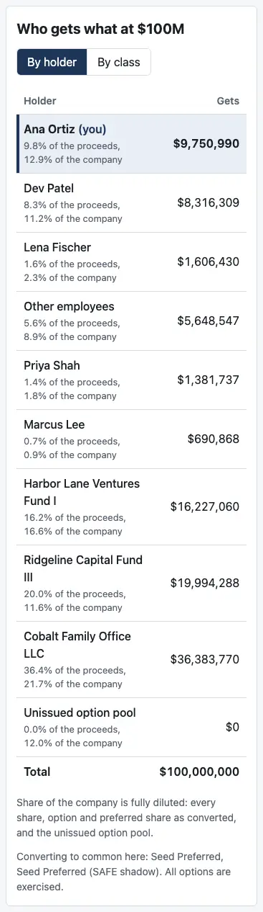
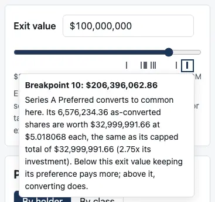

# Review: M3 (the dashboard), with M3e (deploy, phones and keyboards)

Branch `m3e-deploy`, the last of M3's five PRs. With it, the dashboard goes live at **https://spillpoint.github.io/spillpoint/** once you've set one thing in GitHub's settings (below). This note covers what M3e changes, then M3 as a whole. M3a–M3d each have their own note (`notes/review-m3a.md` … `review-m3d.md`).

## GitHub settings: what to set, and when

1. **Now, before you merge this PR:** go to the repository's **Settings → Pages**. Under "Build and deployment", set **Source** to **GitHub Actions**. Nothing else on that page needs changing; leave "Custom domain" empty. This also creates the `github-pages` environment the deploy uses.
2. **Check, but don't expect to change: Settings → Environments → github-pages.** Under "Deployment branches and tags", `main` should be allowed. Pages adds that rule itself. Any other branch that's allowed doesn't matter, because only `main` triggers the deploy.
3. **Merge the PR.** The new **Pages** workflow runs on `main`: build, test, then deploy. Follow it in the **Actions** tab under "Pages". It takes about two minutes, and the "deploy" job shows the page's address when it's done.
4. **If you merged before step 1,** the deploy job fails because Pages isn't switched on for the repository yet. The build job will have passed. Do step 1, then go to **Actions → Pages → Run workflow** and run it on `main`.
5. **Only if step 1 doesn't offer "GitHub Actions" as a source:**
   - **The organization may restrict Pages.** Under the **spillpoint organization's Settings → Member privileges → Pages creation**, allow public sites.
   - **The organization or repository may allow only certain actions.** Under **Settings → Actions → General**, allow `actions/upload-pages-artifact` and `actions/deploy-pages`.

   CI already runs `actions/checkout` and `pnpm/action-setup`, so both are probably fine already.
6. **Optional, after the first deploy:** on the repository's front page, click the gear next to "About" and set **Website** to `https://spillpoint.github.io/spillpoint/`, so the link shows there.

Branch protection doesn't change. The new workflow never runs on pull requests, so it adds no required check, and CI's "test" check is untouched.

## Run it

- **Live:** https://spillpoint.github.io/spillpoint/, once the steps above are done.
- **Locally:**

  ```bash
  pnpm install && pnpm dev
  ```

  `pnpm preview` serves the built page, privacy policy included, exactly as Pages will.

## What M3e changes

### CI and permissions

- **New: `.github/workflows/pages.yml`.** It runs on each push to `main` and when started by hand. It never runs on pull requests.
  - **Before deploying, it checks what CI checks:** install, typecheck, build, and the tests, including the privacy test of the built page.
  - **Permissions:** `contents: read` for the whole workflow. Only the deploy job adds `pages: write`, to publish the site, and `id-token: write`, so Pages can confirm the deploy comes from this workflow. No other job can write anything.
  - **Actions:** `actions/upload-pages-artifact@v5` and `actions/deploy-pages@v5` are new. Checkout, pnpm and Node are set up as in CI.
- **No other changes** to `.github/workflows/` or `.claude/`.

### The page on a phone

I checked every view in headless Chrome at 375 pixels wide (most phones) and 320 (the narrowest). That covers Millrace's payouts by holder and by class, its editor, case 4, and a blank table. Nothing runs off the screen. The one thing that scrolls sideways is the editor's shares grid, inside its card, with the holder column held in view.

- **The example picker** takes the full width instead of running off the right edge. *(M3a review.)*

  
- **The payouts table fits.** On a phone, the two share columns become a line under each name: "9.8% of the proceeds, 12.9% of the company". The stylesheet shows one form or the other, so a screen reader hears it once. *(M3a review.)*

  
- **The chart fits down to 320 pixels.** Its last axis label ("$300M") is no longer clipped.

  [The curves at 320 pixels](screenshots/m3e-small-chart.webp)
- **A breakpoint mark's box** near either end of the slider is held to that side, so it stays on screen.

  
- **Cards have less padding on a phone,** leaving more room for the numbers.
- **On "Who is paid first",** long series names wrap, so their menus stay on screen.

### The keyboard

I walked the whole page with Tab in Chrome:
- **The order:** masthead, the tabs, "You are", the exit value and its marks, the chart's controls, the legend, the table's toggle, then the breakpoint list. It then cycles back to the start.
- **Focus is visible** on every stop.
- **Nothing traps** the keyboard.

Three changes:
- **Escape closes a breakpoint mark's box,** whether it was opened by focus or by pointing, without moving focus. This follows the WCAG rule for content that appears on hover or focus.
- **The tabs take the usual keys:** Left and Right move between them, and Home and End jump to the first and last. Before, both arrows did the same thing.
- **The chart's drawing is no longer a stop.** The chart library made it focusable, for browsing values with the arrow keys. But it sits inside the chart's single labelled image, so screen readers couldn't use it, and its values are in the legend anyway. Keyboard users move the exit value with the slider or the box, and read every value from the legend.

### Also in this PR

- **The root README** now links the page. It says only what the page does today, and what it doesn't do yet: rounds, dividends, warrants, carve-outs, earnouts, and SAFEs or notes at a sale.
- **`docs/ASSUMPTIONS.md`, C13,** now records the save format as built (M3d).
- **`notes/design-m3.md`** describes the narrow-screen and keyboard pass as built.
- **Tests:** 2 new, 101 for the dashboard in all.
  - **Escape** closes a mark's box.
  - **The tab keys** work as described.
  - **The payouts table's phone line** is checked inside an existing test.
- **`pnpm screenshots`** takes five new shots (150 KB): four phone shots, and an overview of the finished page for this note. `OUT=…` writes shots elsewhere.
- **Dashboard tests may now take up to 20 seconds each,** up from 5. Three of them do real work: Millrace's breakpoints twice, or case 6b built click by click. Each takes about a second alone, but they timed out once while this machine was heavily loaded. They would on a slow CI runner too.

## What to click for M3e

1. **On a phone,** or in your browser's device mode at 375 and 320 pixels wide:
   - the picker fits
   - "Who gets what" shows the shares under each name
   - the last breakpoint mark's box stays on screen
   - nothing scrolls sideways except the editor's shares grid
2. **With the keyboard only:**
   - **Tab through the page.** Focus is always visible.
   - **On a breakpoint mark,** its box opens; press Escape and it closes.
   - **On the "Payouts" tab,** press End, Home, and the arrows.
3. **After the deploy,** open https://spillpoint.github.io/spillpoint/ and the browser's developer console:
   - **The console** stays empty while you use the page.
   - **Network:** the page loads four of its own files from github.io and nothing else.
   - **Save and Open** work from the live page as they do locally.

## M3 as a whole

### What M3 delivers

Every item on CLAUDE.md's M3 list, plus what you asked for along the way:

| CLAUDE.md, M3 | Where | How to check |
|---|---|---|
| First screen: the founder view | M3a | It opens on Millrace: "At $100M you get $9.75M … You get nothing below $39.4M." |
| Exit-value slider with a who-gets-what table, by holder and by class | M3a | Drag the slider or type "25M"; switch "By class". |
| Payoff curves by holder and by class, with breakpoints marked | M3b | The numbered marks; filled ones change your payout. Drag to zoom. |
| Breakpoint list, each with its plain-English reason | M3b | Ten for Millrace, with a "For you" line on the eight that change Ana's payout. |
| Cap table editor | M3c | Build case 6b from a blank table (review-m3c.md, step 4). |
| Save and load a JSON file | M3d | Save, then Open the file: same table, same view, payouts identical to the cent. |
| A visible note that the charter and signed documents govern | M3a | Under the masthead, on every view. |
| The GitHub Pages deploy | M3e | The address above, once deployed. |

**Added at your request:**

| Request | PR |
|---|---|
| The slider marks' caption, and their boxes on hover or focus | M3b |
| "For you" lines on each breakpoint, as dollars per extra $1M, or the size of a jump | M3b |
| Prices shown to six decimal places, with the exact value kept until edited | M3c |
| No assumption codes in the messages shown on the page | M3c |
| "A blank cap table" | M3c |
| Exact values in saved files | M3d |
| The view kept in saved files | M3d |
| The phone fixes | M3e |

### How it was kept honest

- **The numbers come from the engine you published as 0.0.1,** read from its sources. The page does no arithmetic of its own beyond display: rounding, and shares of the total.
- **Tests check the page against the locked cases.**
  - **Case 6b,** built click by click in the editor, matches its `expected.json` at all nine exit values, and its two breakpoints.
  - **Millrace,** saved and opened again, gives identical payouts to the cent at every breakpoint.
- **Privacy is enforced by the browser, not only by the code.**
  - **The built page carries a Content-Security-Policy** that blocks every connection.
  - **A test builds the page** and checks the policy, that the page loads only its own files, and that its scripts have no network or storage calls.

### Tests

- **Engine:** 457, unchanged through M3.
- **Dashboard:** 101, all new in M3, run in a simulated browser. One builds the page, for the privacy test.

The reference check passes.

### The page's size

- **Its script is 691 KB,** or 211 KB compressed. Most of it is the charting library.
- **It loads once.** After that, nothing more is fetched.

### Assumptions added in M3

- **X8:** a note for M5's payment view (warn on a payment that lowers a holder's running total). From M3 planning.
- **C13:** the save format as built (above).

There are no other modeling choices. The dashboard's choices were about presentation, and each PR's review note lists them with your answers.

### CI and permissions changes across M3

- **M3a–M3c:** none.
- **M3d:** none to the files, but CI's test step now builds the page once more, inside the privacy test (about a second).
- **M3e:** the new Pages workflow, above.

### Carried forward, not M3's

- **The next `cases/` unlock** (`notes/next-unlock.md`):
  - Millrace's "within $1" wording
  - "(SAFE shadow)" becomes "(from SAFEs)"
  - the E13 case
- **Before M4:** cases for R20–R22 (pay-to-play), and the pro-rata base counting outstanding SAFEs and notes (R6).
- **Before M5:** exit cases for SAFEs and notes with a discount, with no cap, and alongside preferred (X9, X12). M5 also brings X8's payment warning.
- **Known limits of the page today:**
  - **The slider's marks are small to tap** on a phone. The breakpoint list does the same job with large targets.
  - **On a 320-pixel screen** the chart is narrow and leaves some breakpoint numbers off, and says so.
  - **On a phone, the editor's shares grid scrolls sideways.**

## Open questions

1. **Should the page show which engine version made its numbers,** such as "spillpoint 0.0.1" at the foot of the page? A founder sharing a screenshot would then know which rules produced it. It's not built; say if you want it in M4.

M3 is complete when this merges and the page is live. I'm stopping here; M4 (rounds) waits for you.
