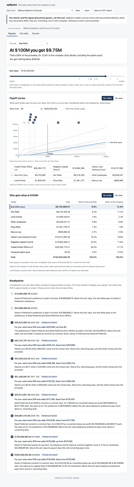
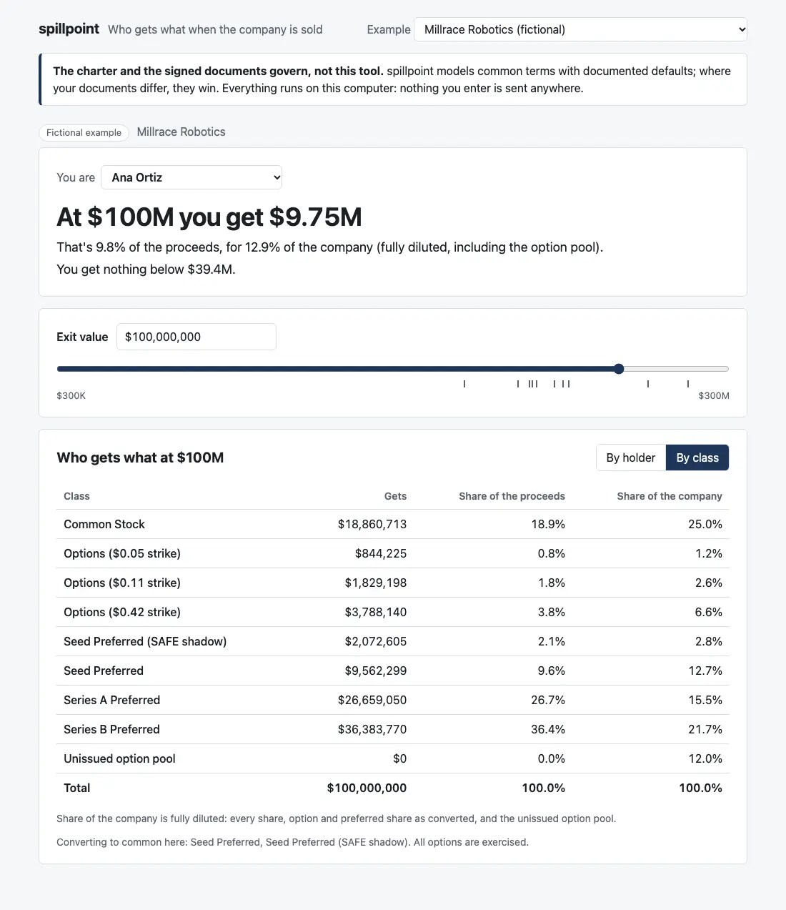
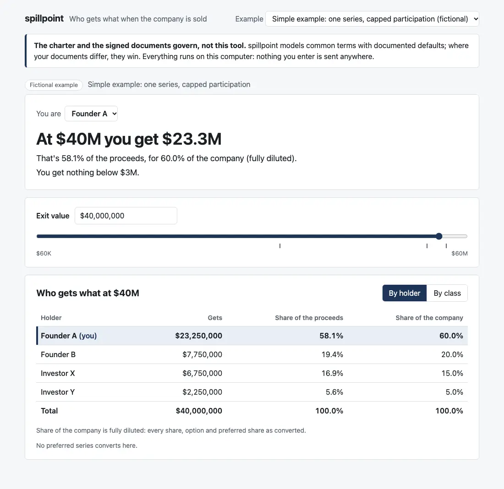

# Review: M3a (the founder view)

Branch `m3a-founder-view`, the first of M3's five PRs. The dashboard now exists and opens on the founder view. **Please approve the design direction in [`design-m3.md`](design-m3.md) before M3b builds on it.**

## Run it

```bash
pnpm install && pnpm dev
```

Then open the address it prints (usually http://localhost:5173/).

## What to click



1. **It opens on Millrace, labelled "Fictional example".** The governance note sits under the masthead: "The charter and the signed documents govern, not this tool… nothing you enter is sent anywhere."
2. **The founder view starts on the largest common holder, Ana Ortiz, at $100M:**
   - **"At $100M you get $9.75M".**
   - **"That's 9.8% of the proceeds, for 12.9% of the company (fully diluted, including the option pool)."**
   - **"You get nothing below $39.4M."** That's where Seed's preference is paid in full and common starts receiving. It appears a moment after the page loads, once the breakpoints have been computed in the background.
3. **"You are":** pick Cobalt Family Office LLC. It gets $36.4M and is "paid from the first dollar".
4. **The exit value:**
   - **The slider** is on a log scale from $300K to $300M, so the low end gets room.
   - **Tick marks** sit at the ten breakpoints; hover one to see its value.
   - **Or type an amount** ("25M", "$39.4m", "250,000"). An amount outside the range is refused with a message.
5. **Who gets what,** by holder: each holder's payout, its share of the proceeds, and its fully diluted share of the company. Your row is marked "(you)". The unissued pool is listed at $0, so the shares add to 100%. Under the table, which series convert and whether options are exercised.
6. **"By class":** the same by class, in cap-table order: common, options by strike, then preferred from junior to senior.

   
7. **The example picker:** choose "Simple example" (case 4). Founder A gets $23.3M at $40M, and "nothing below $3M".

   
8. **On a phone,** the cards stack and the table scrolls sideways within its card. M3e does the full narrow-screen pass. [Phone screenshot](screenshots/m3a-phone.webp)

## What changed

- **`apps/dashboard` (new):** Vite + React, as the M3 plan describes:
  - **`spillpoint` resolves to the engine's sources** (`packages/engine/src`), so the dashboard always runs the current engine with no build step. The npm package still ships `dist/`.
  - **The examples are read from `cases/` at build time** by a small Vite plugin. It takes Millrace's post–Series B cap table and case 4's exit, nothing else, so the page doesn't ship whole `expected.json` files.
  - **The breakpoints compute in a Web Worker,** a background thread, so the page stays responsive: Millrace takes about 0.3 seconds. The headline's numbers come from a single `solve` on the page itself, about 4 ms, so the slider updates as you drag.
  - **No network calls.** The built page contains no `fetch`, XMLHttpRequest, beacon or WebSocket. I turned off Vite's module-preload helper, the one place a `fetch` appeared; it only ever fetched the page's own files. M3d adds a Content-Security-Policy and a test to keep it this way.
  - **Tests:** 15 Vitest and Testing Library tests, run in a simulated browser. They cover the money formatting, the log scale, and the founder view as you'd click through it: the Millrace headline, Ana's "$39.4M", switching holder, typing a value, a refused value, the tables, and the simple example.
  - **`pnpm screenshots`:** a small script that drives headless Chrome to take this note's screenshots. Waiting for the background computation was why Chrome's own screenshot option wasn't enough.
- **The root `package.json`** gains `pnpm dev`. `pnpm build`, `pnpm test` and `pnpm typecheck` now include the dashboard.
- **`docs/ASSUMPTIONS.md`:** X8's note for M5's payment view, as you asked.
- **`notes/design-m3.md`** and these screenshots, in `notes/screenshots/` (WebP, 232 KB in all).

## CI and permissions

No changes to `.github/workflows/` or `.claude/`. CI's existing steps now also typecheck, build and test the dashboard, on Node 24 and on Node 22.

## Decisions I made, for you to check

1. **"The largest founder"** is whoever holds the most common stock: Ana Ortiz in Millrace, Founder A in case 4.
2. **The slider's low end** is a thousandth of the range's top ($300K for Millrace), because a log scale can't reach $0. You can still type any value in the range, including $0.
3. **"You get nothing below $X"** is the first breakpoint where your payout rises above zero. If you're paid from the start, it says "You're paid from the first dollar". If nothing reaches you in the range, it says "You get nothing up to $X".
4. **"Share of the company"** is fully diluted, including the unissued pool, as you asked. The pool appears as its own row at $0 so the column adds to 100%. When a cap table has no pool, the text doesn't mention one.
5. **New dependencies,** as agreed:
   - **Runtime:** react, react-dom.
   - **Development:** vite, @vitejs/plugin-react, vitest, @testing-library/react, @testing-library/dom, jsdom, typescript, and @types for React and Node.

   Recharts comes with M3b.

## Open questions

1. **The design direction** in `design-m3.md`: approve, or what to change before M3b?
2. **Anything on the founder view you'd word differently?** It's the first thing a founder reads.

Next is M3b: payoff curves and the breakpoint list. I'm stopping here.
