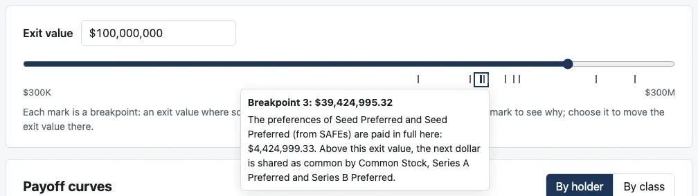
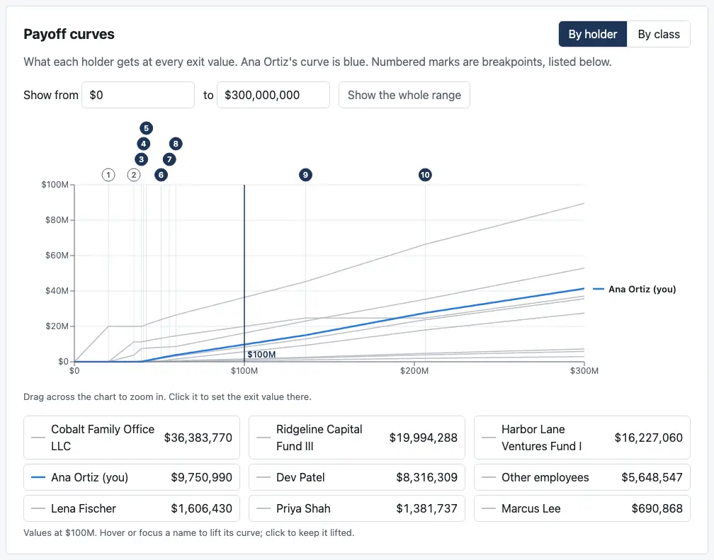
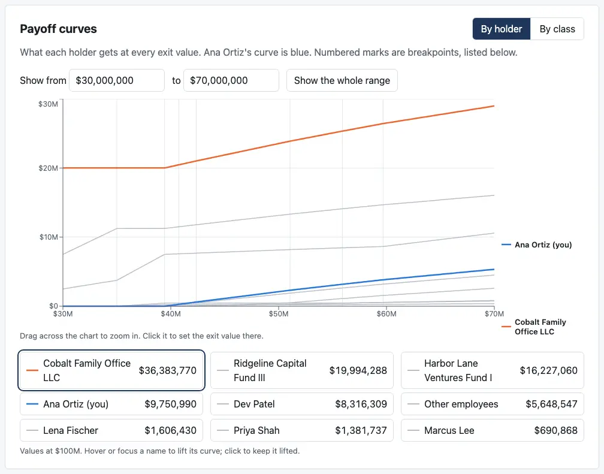
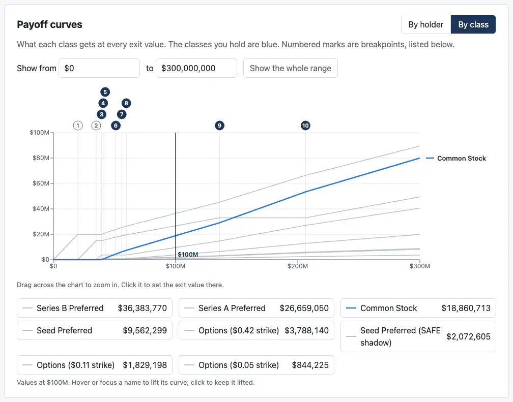

# Review: M3b (payoff curves and breakpoints)

Branch `m3b-curves`, the second of M3's five PRs. It adds the payoff curves, the breakpoint list, and the explanation for the slider's tick marks that you asked for in the M3a review.

## Run it

```bash
pnpm install && pnpm dev
```

Then open the address it prints (usually http://localhost:5173/). Everything below is on Millrace, which the page opens on, with Ana Ortiz as "you".

## What to click

1. **The slider's marks.** Under the slider:
   - **A caption:** "Each mark is a breakpoint: an exit value where someone's payout bends or jumps. Hover over or tab to a mark to see why; choose it to move the exit value there."
   - **Hover over the third mark, or tab to it.** A box shows "Breakpoint 3: $39,424,995" and its reason: Seed's preferences are paid in full, and above this the next dollar is shared as common.
   - **Click it.** The exit value moves to $39,424,995 and the headline reads "At $39.4M you get $0". It's exactly the point where Ana's payout starts.

   

2. **The payoff curves.** A new card under the slider:
   - **Ana's curve is blue,** thicker, and labelled "Ana Ortiz (you)" at its right end. The other holders are thin grey lines.
   - **The numbers along the top** are the ten breakpoints, numbered as on the slider and in the list. **Filled** numbers change your payout (3 to 10 for Ana); **hollow** ones don't (1 and 2, Series B's and Series A's preferences being paid).
   - **The dark vertical line** is the current exit value, $100M.
   - **Hover over the chart:** a box lists every holder's payout at that exit value, largest first.
   - **Click the chart** to move the exit value there, rounded to three significant figures.

   

3. **The list under the chart** names every holder with its payout at the current exit value, largest first. It doubles as the legend:
   - **Hover over a name, or tab to it:** that holder's curve turns orange and gets its own label.
   - **Click the name** to keep it lifted. Click again to let it go.

4. **Zoom.** Drag across the chart from about $30M to $70M; or type "30M" and "70M" in "Show from … to …". The chart redraws from $30M to $70M with breakpoints 2 to 8 spread out. "Show the whole range" goes back. A range that runs backwards, or leaves $0 to $300M, is refused with a message.

   

5. **By class:** the toggle on the card's top right. Common Stock is blue (it's the class Ana holds); the other eight classes are grey.

   

6. **The breakpoint list** at the bottom of the page:
   - All ten breakpoints, with the same numbers, each with its plain-English reasons from the engine.
   - **"Changes your payout"** marks the ones that bend or jump Ana's payout: 3 to 10.
   - **Choose a breakpoint** to move the exit value there. That entry gains "The exit value is here".
   - **Switch "You are" to Cobalt Family Office LLC:** the marks move to 1 and 3 to 10. Cobalt's Series B is paid first up to $20M, then waits while Series A and Seed are paid. The chart's filled numbers follow.

   [The full list](screenshots/m3b-breakpoints.webp)

7. **On a phone,** the curves' labels sit inside the chart instead of beside it. Where the numbers crowd together, three are left off and a line under the chart says so; zooming in shows them. [Phone screenshot](screenshots/m3b-phone.webp). M3e does the rest of the narrow-screen pass.

**Not in either example: jumps.** Neither Millrace nor case 4 has a breakpoint where payouts jump. Where one does, the list tags it "Payouts jump", and the chart breaks the line there and joins the two sides with a dashed segment. The tests cover this with a made-up curve; you'll be able to click through one once M3c's editor lets you enter a cap table with a conversion group.

## What changed

- **The background thread** now works out the curves as well as the breakpoints. Every payout is a straight line between breakpoints (SPEC, Breakpoints), so a curve is exact from its value at each breakpoint and at the ends of the range: about a dozen more solves, and the whole thing still takes about a third of a second for Millrace. The page stays responsive while it runs and shows "Working out the curves and breakpoints…" until it's done.
- **New:**
  - **`PayoffChart.tsx`:** the curves card.
  - **`BreakpointList.tsx`:** the list.
  - **`curves.ts`:** turns the curve points into chart lines, and decides which breakpoints change a holder's payout.
- **`ExitSlider.tsx`:** the marks are now buttons, with the caption and the box that shows a mark's exit value and reasons.
- **Recharts** draws the charts, as CLAUDE.md names it. It marks the breakpoints cleanly, so no alternative was needed.
- **Tests:** 23 new, 38 for the dashboard in all.
  - **10 for the curve math:** straight lines between breakpoints, jumps kept apart from bends, ignoring a change under half a cent, and the rows the chart draws.
  - **13 that click through the page:**
    - the curves, by holder and by class
    - the numbered breakpoints, all ten at the full range and 2 to 8 when zoomed
    - lifting and pinning a curve
    - zooming by typing, and a refused range
    - the list, with Ana's eight and Cobalt's marks
    - choosing a breakpoint
    - the slider's caption, its marks' names and boxes on focus and hover, and choosing a mark
- **Still no network calls or browser storage.** The built page contains no `fetch`, XMLHttpRequest, beacon, WebSocket, localStorage, sessionStorage or IndexedDB.
- **`pnpm screenshots`** takes the six new shots, cropped to the part of the page each one shows (245 KB in all).
- **`notes/design-m3.md`:** principle 5 and the M3b line now describe the curves as built (decision 1 below), and M3e's two phone fixes from your M3a review are recorded.
- **`notes/next-unlock.md`:** renaming "Seed Preferred (SAFE shadow)" to "(from SAFEs)", as you asked. Until that unlock, the dashboard shows the case's current name; you'll see it in the list and the by-class view.

## CI and permissions

No changes to `.github/workflows/` or `.claude/`.

## Decisions I made, for you to check

1. **Emphasis instead of nine line styles.** The design note said the curves would "use different line styles". With nine holders, nine dash patterns crossing and running together in the $35M–$60M stretch were harder to read than one highlighted line. So:
   - **Your curve** is blue, thicker and labelled.
   - **The one you point at** is lifted in orange and labelled.
   - **The rest are grey,** for context.

   Color is never the only cue. The two colored lines are labelled in words, and the legend and hover box name every holder with its value. If you'd rather have dash patterns on the grey lines too, it's a small change.
2. **"Changes your payout"** means your payout jumps by more than half a cent there, or its slope changes. It's worked out from the curve, so it follows whichever holder you choose. A breakpoint that changes only other holders' payouts gets a hollow number and no tag.
3. **Just above a jump,** the chart uses the payout one millionth of a dollar above the breakpoint. That's for drawing only; the tables and headline always solve at the exact exit value.
4. **Clicking the chart** rounds the exit value to three significant figures ($62.4M, not $62,413,977.12), as the slider does. To land exactly on a breakpoint, choose its mark or its entry in the list.
5. **Crowded breakpoint numbers** step up into as many as four rows. Beyond that, a number is left off, with its line still drawn, and the chart says how many and to zoom in. At the full range on a laptop all ten show; on a phone three are left off.
6. **The page's script is bigger:** 659 KB (202 KB compressed), up from 292 KB (94 KB) in M3a. Nearly all of it is Recharts. It loads once and everything after runs locally, so I've left it as one file. Vite prints a size warning during the build, which CI ignores. If you'd like, M3e can load the chart separately so the founder view appears a moment sooner.

## Open questions

1. **Decision 1:** emphasis as built, or dash patterns on the grey lines as well?
2. **Anything in the breakpoint reasons you'd word differently** now that you see them on the page? They're the engine's wording from M2e, unchanged.

Next is M3c, the cap table editor. I'm stopping here.
