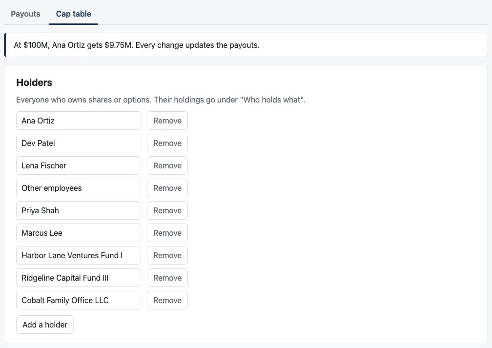
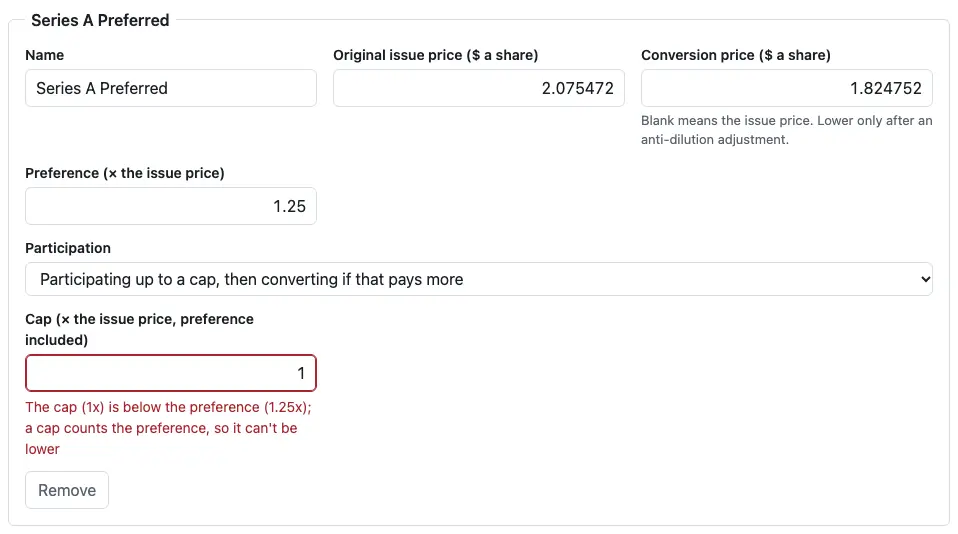
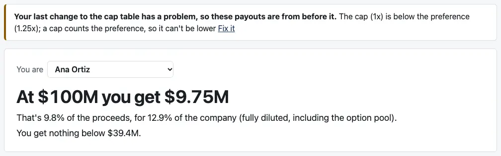
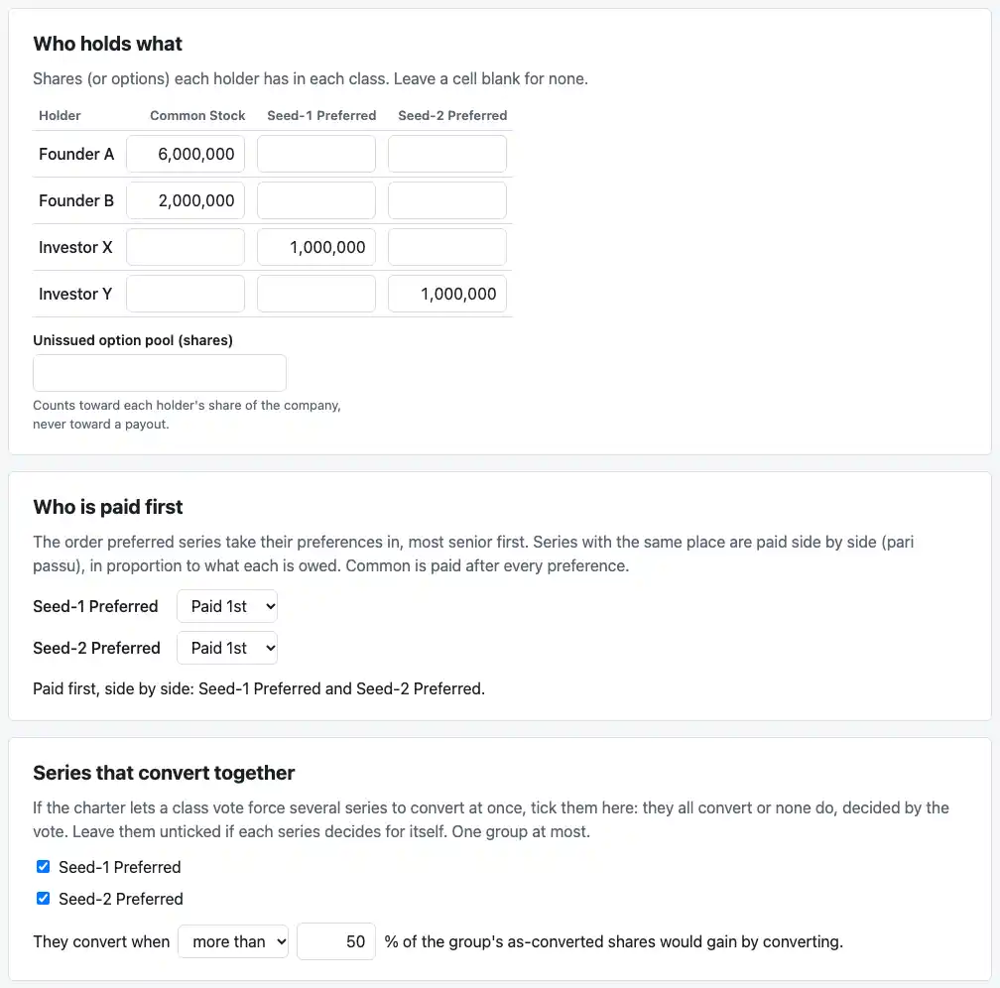
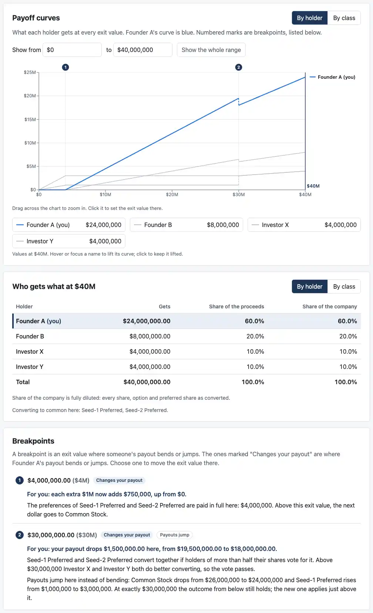

# Review: M3c (the cap table editor)

Branch `m3c-editor`, the third of M3's five PRs. The dashboard gets a second tab, "Cap table", where you can edit everything the engine supports at exit. The engine reads each change straight away. When it refuses an input, its own message appears next to the field it names.

## Run it

```bash
pnpm install && pnpm dev
```

Then open the address it prints (usually http://localhost:5173/).

## What to click

1. **The "Cap table" tab,** next to "Payouts" under the example's name. At the top, a line says what the current table pays you: "At $100M, Ana Ortiz gets $9.75M. Every change updates the payouts." Below it are six cards:
   - Holders
   - Classes of stock
   - Who holds what
   - Who is paid first
   - Series that convert together
   - Exit values to explore

   

2. **An edit you can check by hand.** Set "Start from" to "Simple example" (case 4), open "Cap table", and change Seed Preferred's cap from 3 to 2.
   - **The line at the top** now reads "At $40M, Founder A gets $24M."
   - **Why:** capped at $6M, Seed does better converting. Its 2 of 10 million shares of $40M are worth $8M. Founder A then has 6 of the 10 million shares, so $24M.
   - **Back on "Payouts":** the headline says the same, and the example's name gains ", with your changes".

3. **When the engine says no.** On Millrace, set Series A's cap to 1.
   - **Under the field,** in the engine's words: "The cap (1x) is below the preference (1.25x); a cap counts the preference, so it can't be lower (E7)".
   - **The line at the top** says the payouts can't update until it's fixed, with a "Go to the field" link.
   - **On "Payouts":** a banner says your last change has a problem, so these payouts are from before it. The headline stays at $9.75M. "Fix it" takes you back to the field.
   - **Put 2.75 back,** and everything updates again.

   

   

   Two more to try:
   - **Type 5,500,000.5 in Ana's Common Stock cell.** The message appears under the grid, naming the cell: "Ana Ortiz, Common Stock: Share counts must be whole and not negative".
   - **Type "about a dollar" as a price.** The engine replies that it "is not an exact number".

4. **Case 6b, built from scratch,** as you planned:
   1. Set "Start from" to "Scratch". Open "Cap table".
   2. **Holders:** rename "Founder" to Founder A, and add Founder B, Investor X and Investor Y.
   3. **Classes of stock:** add two preferred series, Seed-1 Preferred at an issue price of 1 and Seed-2 Preferred at 3. The other terms keep their defaults (1×, non-participating).
   4. **Who holds what:**
      - Founder A: 6,000,000 common
      - Founder B: 2,000,000 common
      - Investor X: 1,000,000 Seed-1
      - Investor Y: 1,000,000 Seed-2
   5. **Who is paid first:** "Paid 1st" for both. A new series starts in a tier of its own, paid first, so Seed-1 needs moving back up. The sentence then reads "Paid first, side by side: Seed-1 Preferred and Seed-2 Preferred."
   6. **Series that convert together:** tick both. The vote defaults to "more than 50%".
   7. **Exit values to explore:** set "To" to 40M.

   Then open "Payouts":
   - **The breakpoint at $4M** is where both preferences are paid.
   - **The jump at $30M** is where the group converts. Founder A's line drops there, drawn dashed. The list tags breakpoint 2 "Payouts jump" and says "For you: your payout drops $1,500,000 here, from $19,500,000 to $18,000,000."
     - **Below $30M,** common shares $26M, and Founder A has 6 of the 8 million common shares.
     - **Above it,** everyone is common: 6 of the 10 million shares.
   - **A test does the same, click by click.** It checks every holder at all nine exit values in the locked case's `expected.json`, and both breakpoints.

   

   

5. **Millrace's other cards:**
   - **Who is paid first:** the sentence reads "Paid first: Series B Preferred. Then: Series A Preferred. Then, side by side: Seed Preferred and Seed Preferred (SAFE shadow)."
   - **Series that convert together:** Series B can't be ticked. It's participating without a cap, so it never converts.

   [Who holds what, who is paid first, and converting together](screenshots/m3c-holdings.webp)

6. **Not losing edits:**
   - **Removing a holder or class that holds shares** asks first: "Remove Ana Ortiz? Its 5,500,000 shares go too."
   - **Changing "Start from"** after any edit asks first, and Cancel keeps your changes.
   - **Without edits,** neither asks.
   - **Leaving or reloading the page** isn't covered yet. That warning comes with saving in M3d.

7. **The range:** set "To" to 50M. The exit value, which was $100M, moves to $50M, the new top of the range.

8. **On a phone,** the shares grid scrolls sideways and the holder column stays in view. [Phone screenshot](screenshots/m3c-phone.webp). M3e does the rest of the narrow-screen pass.

## What changed

- **New:**
  - **`CapTableEditor.tsx`:** the six cards.
  - **`draft.ts`:** the editor's model. It turns an example into editable text, builds the engine's input back, and maps each engine error path to the field it names.
- **`App.tsx`:**
  - the two tabs
  - "Start from", with Scratch
  - the payouts held at the last accepted table, with the banner
  - a plain message instead of a crash if the engine can't settle on an answer at some exit value
- **The curves and breakpoints** wait for a quarter-second pause in typing before recomputing, so the background thread isn't restarted on every keystroke. The headline and the table still update with every change.
- **A guard against dividing by zero:** with no shares at all, which you can reach while editing, "share of the company" is 0% rather than an error.
- **Tests:** 22 new, 67 for the dashboard in all.
  - **9 for the editor's model:**
    - Loading either example and building it back gives the engine exactly the same cap table and range.
    - Typed amounts are read as exact numbers.
    - New rows get unique ids.
    - Removing a row removes its shares.
    - Each engine error lands on the field it names.
  - **13 that click through the page:**
    - case 6b from scratch, against its locked expected values
    - the case 4 edit
    - the three error cases, and "Fix it"
    - the payment-order sentence and the disabled checkbox
    - the narrower range
    - both confirmations
    - scratch
    - the tabs' arrow keys
- **Still no network calls or browser storage** in the built page. The script is 684 KB (208 KB compressed), about 7 KB compressed more than M3b.
- **`pnpm screenshots`** takes the seven new shots (229 KB in all). It now builds case 6b click by click for two of them.
- **`notes/design-m3.md`:** the editor as built. M3e's list also gains the phone shares grid.

## CI and permissions

No changes to `.github/workflows/` or `.claude/`. No changes to `cases/`: the 6b test reads `expected.json` and doesn't change it.

## Decisions I made, for you to check

1. **Two tabs, "Payouts" and "Cap table",** rather than the editor at the foot of one long page. The line at the top of the editor keeps your answer in view while you edit.
2. **While an edit has a problem,** the payouts stay on the last table the engine accepted, with a banner saying so, rather than going blank. Typing a number one character at a time passes through invalid states, and blanking the page on each one would be jarring.
3. **One error at a time.** The engine stops at the first problem it finds, in reading order: holders, classes, order of payment, conversion group, holdings, pool, range. Fix that one and the next appears, if there is one. Some mistakes are impossible in the editor, so you'll never see the engine's errors for them:
   - a holding for an unknown holder
   - a series in two tiers
   - the same holding listed twice
4. **The engine's own words,** with the path dropped because the field's place already says it, and the first letter capitalized. Some include an assumption code, such as "(E7)". Your M2d rule against codes was for breakpoint reasons; see question 1.
5. **What you can type:**
   - "1,000,000"
   - "$1.50"
   - "1.5x" or "1.5×"
   - "50%"
   - "40M" or "1.5B" for the range
   - "a/b" for an exact fraction

   Anything else goes to the engine as typed, so its message quotes it. Blanks mean what C12 says a missing field means:
   - an empty share cell is no holding
   - an empty pool is none
   - an empty conversion price is the issue price
6. **Millrace's prices stay exact.** They're fractions from its rounds, such as Series A's 3900000/1879091, shown as they are with "About $2.07547 a share" beneath. Typing over one replaces it.
7. **Ids:**
   - **Loaded holders and classes keep their ids.**
   - **New ones get an id from their name:** Founder B becomes founder_b, with _2 added for a duplicate. That keeps readable the few engine messages that name an id. Saved files (M3d) will carry them.
   - **Renaming a loaded row keeps its id,** so files stay consistent.
8. **Order:** the editor keeps the loaded file's order of holdings, and of the series within a tier. An unedited example gives the engine exactly the input it had, and the reasons name series in the same order ("Seed Preferred and Seed Preferred (SAFE shadow)").
9. **Defaults for new rows:**
   - **A new preferred series:** $1 issue price, 1×, non-participating, in its own tier, paid first.
   - **A new option class:** a $0 strike.
   - **Scratch:** one holder, Founder, with 10,000,000 common shares, $0 to $100M, at $50M.
10. **Not in the editor:**
    - **Anti-dilution:** at exit it matters only through the conversion price, which you can edit. The method is kept as loaded, for the record.
    - **Arriving later:** warrants, dividends, carve-outs, earnouts, and SAFEs and notes at exit come in M5; rounds in M4.
11. **Confirmations** use the browser's own OK/Cancel box: plain, and it works with the keyboard and screen readers.

## Open questions

1. **Assumption codes in error messages**, such as "(E7)": keep them, or strip them as for breakpoint reasons? Founders won't know them; for you they point straight to the rule.
2. **"Start from"** is the picker's new label, since it now offers Scratch as well as the examples. OK, or would you name it differently?

Next is M3d: save and load, the unsaved-changes warning, and the privacy hardening. I'm stopping here.
