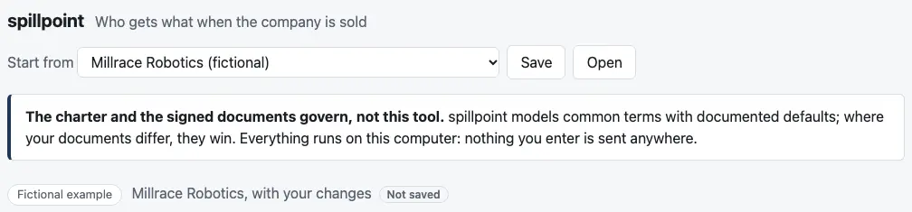
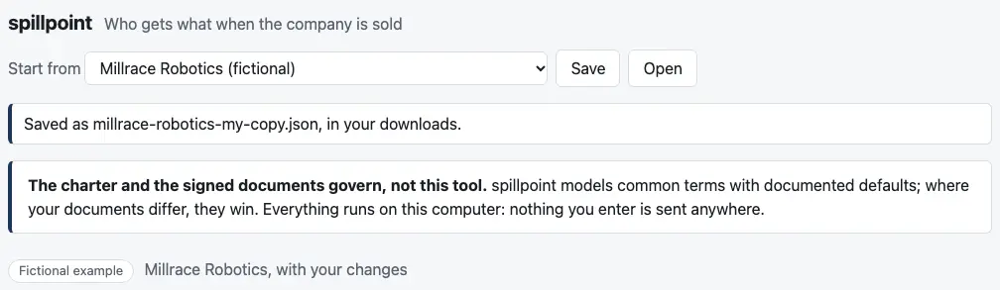

# Review: M3d (save, open, and privacy)

Branch `m3d-save-load`, the fourth of M3's five PRs. A cap table can now be saved to a local file and opened again. The page warns before unsaved changes are lost. The built page also tells the browser to refuse any request it might make.

## Run it

```bash
pnpm install && pnpm dev
```

Then open the address it prints (usually http://localhost:5173/). The privacy policy (step 7) applies to the built page, so check that one with:

```bash
pnpm preview
```

That builds the page and serves it at http://localhost:4173/.

## What to click

1. **Save.** The masthead now has "Save" and "Open" beside "Start from". On Millrace, click Save.
   - **The file:** millrace-robotics-fictional.json lands in your downloads. A line under the masthead says "Saved as millrace-robotics-fictional.json, in your downloads."
   - **Open it in a text editor.** It has the agreed fields: `"format": "spillpoint"`, `"version": 1`, the name, the cap table and the range.
   - **Your requirement:** Series A's issue price is saved as `3900000/1879091`, exactly, though the editor shows 2.075472. A field you edit saves what you typed.

2. **The name and "Not saved".** On the "Cap table" tab, a new field at the top, "Name of this cap table", names the saved file. Change it, and "Not saved" appears after the cap table's description above the tabs. Save, and it goes.

   

   

3. **Open.** Click Open and choose the file you saved.
   - **The line under the masthead** says "Opened millrace-robotics-fictional.json." The line above the tabs reads "Millrace Robotics (fictional), opened from millrace-robotics-fictional.json".
   - **The exit value starts at $150M,** halfway up the range, because a file keeps no exit value (question 1). Type 100M and Ana gets $9.75M, as before.

4. **Unsaved changes are never lost without asking.** Change anything, then try to reload or close the tab: the browser asks first. After a save it doesn't. "Start from" and "Open" ask too, but only when there are unsaved changes.

5. **A table with a problem isn't saved.** Set Series A's cap to 1 and click Save. No file appears. The line under the masthead says "Not saved: the cap table has a problem to fix first. The cap (1x) is below the preference (1.25x)…"

6. **A file that can't be opened says why,** and the table you had stays open. Try opening `cases/millrace/inputs.json`: "Couldn't open inputs.json. It isn't a spillpoint file: spillpoint files start with "format": "spillpoint"." The tests also cover:
   - a file from a newer version
   - a field spillpoint doesn't read
   - a cap table the engine refuses (its message, without assumption codes)
   - a warrant ("The engine supports this from M5")

7. **Privacy.** Run `pnpm preview`, open the page, and open the browser's developer console.
   - **While you use the page,** the console stays empty: nothing the page does is refused.
   - **Then type `fetch("/")`.** The browser refuses it: "Refused to connect because it violates the document's Content Security Policy." It would refuse the same for any address.

**Your test:** in [`test/save-open.test.tsx`](../apps/dashboard/test/save-open.test.tsx), "saving Millrace and opening it again gives identical payouts to the cent at every breakpoint":
1. It clicks Save, opens the downloaded file with Open, and checks the headline at $100M.
2. It saves again. The second file is byte for byte the first.
3. The engine then finds the same ten breakpoints, and the same payout to the cent for every holder and every class at each.

[`test/file.test.ts`](../apps/dashboard/test/file.test.ts) does the same for both examples without the clicking.

## What changed

- **New `src/file.ts`:**
  - writes the file
  - names it after the cap table
  - reads a file back, refusing what it can't use with a plain reason
  - has a place to migrate older versions forward when version 2 comes
- **`App.tsx`:**
  - Save, Open, and the line under the masthead
  - "Not saved"
  - the warning before leaving the page
  - confirmations now about "unsaved changes"

  The cap table being worked on moved up from the tab into the page, so the masthead can save it.
- **The editor** gains the name field.
- **Privacy:**
  - **A Content-Security-Policy** on the built page. It allows only the page's own scripts, worker and stylesheet, and data: images. It allows no connections, form posts, frames or fonts.
  - **An empty icon,** so the browser doesn't ask the server for /favicon.ico.
  - **A test that builds the page and checks it** (below). I checked it catches a planted `fetch`.
- **`pnpm preview`** at the top level builds the page and serves it.
- **Tests:** 22 new, 94 for the dashboard in all.
  - **10 for the file format:**
    - the round trip for both examples
    - exact values saved for fields nobody edited
    - the agreed fields
    - file names
    - the six refusals
  - **8 that click through Save and Open,** including yours.
  - **4 for privacy.** The test builds the page and checks four things:
    - the policy is there and comes first
    - the page loads only its own files
    - the scripts contain no `fetch`, XMLHttpRequest, WebSocket, EventSource, beacon or browser storage
    - every web address in them is an XML namespace or a library's documentation link inside an error message
- **`pnpm screenshots`** takes two new shots (36 KB). Its browser now refuses downloads, so shots that click Save leave no file behind.
- **The script is 689 KB** (210 KB compressed), 2 KB compressed more than M3c.
- **`notes/design-m3.md`:** Save and Open as built.

## CI and permissions

- **No changes** to `.github/workflows/` or `.claude/`.
- **CI's test step builds the page once more,** inside the privacy test. That takes about a second.

## Decisions I made, for you to check

1. **Only a table the engine accepts is saved,** so a saved file always opens and is always valid engine input. A table with a problem says so instead of saving.
2. **The file keeps no exit value,** as agreed. An opened file starts halfway up its range: $150M for Millrace. See question 1.
3. **How saving and opening work:**
   - **Saving** hands the file to the browser's downloads, named after the cap table: lowercase, with hyphens.
   - **Opening** uses the browser's file picker.
   - **Both work in every browser** without asking for any permission. A browser set to ask where to save will ask.
4. **"Not saved"** means changed since the table was started, opened or last saved. The page can't tell whether you kept the download, so a save counts once the file is handed to the browser.
5. **Strict reading:**
   - **A newer version is refused,** with a message to use the newer spillpoint.
   - **An unknown field is refused,** as C12 does for engine input, so a misspelt one can't be ignored.
   - **Migration:** version 1 is the first, but the step that would migrate an older version forward is in place.
6. **On open, the engine's message keeps its path** ("file.cap_table.securities[5].cap_multiple"), since there's no field to put it beside. The assumption code goes, as on the rest of the page.
7. **The policy is on the built page only:** what GitHub Pages will serve, and what `pnpm preview` shows. `pnpm dev`'s live reload needs a connection the policy would block.
8. **Default names:**
   - **An example** is saved as, say, "Millrace Robotics (fictional)", so "(fictional)" travels with the file.
   - **A blank table** is "My cap table".
9. **Numbers are written as strings** ("5500000"), as C1 prefers for exact numbers. The engine reads either.

## Open questions

1. **Keep the exit value in the file?** It would be one more field in version 1, `"exit_value"`, so an opened file returns to where you were. Today it isn't kept, as agreed.

Next is M3e: the GitHub Pages deploy, the narrow-screen pass, and the review of M3 as a whole. I'm stopping here.
