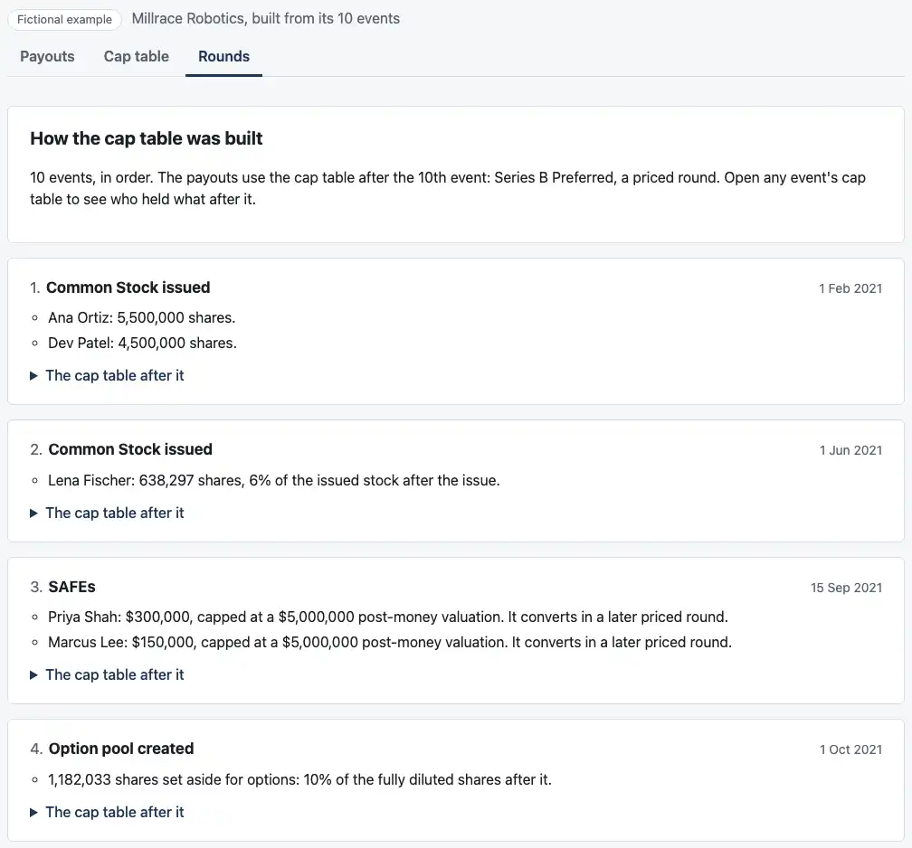
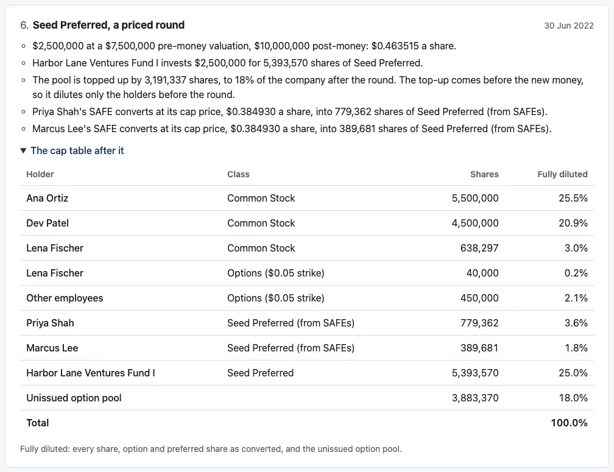
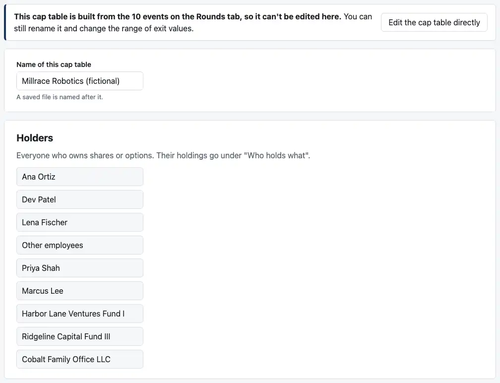

# Review: M4i (the dashboard's Rounds tab)

Branch `m4i-dashboard-rounds`, M4's first dashboard PR.

**Millrace now opens from its rounds.** The page builds its cap table from its 10 events with the engine, as `readInputs` does. The page's build no longer reads the table recorded in `expected.json`.

**A new "Rounds" tab** shows each event, what it did, and the cap table after it.

**While the rounds build the cap table, the Cap table tab is read-only.** "Edit the cap table directly" drops the rounds, after asking and saying what goes, as you asked in the M4 plan.

**Saving keeps the rounds,** in save format version 2. Version 1 files open as they did.



## Run it

```bash
pnpm install && pnpm dev
```

## What to check by behavior

1. **The page opens as before.** Millrace at $100M: "At $100M you get $9.75M". The label above the tabs now reads "Millrace Robotics, built from its 10 events".

   A test compares what the page's Millrace pays with what the locked post–Series B table pays: every holder and class at every breakpoint, to the cent. They're the same.
2. **The Rounds tab:**
   - **Ten numbered cards,** each with its date ("No date" for the two grants the case doesn't date) and what the event did in plain sentences.
   - **The Series B card** is tagged "The payouts use the cap table after this event."
   - **The figures you know:**
     - **The Seed:** the SAFEs convert at their cap price, $0.384930, into 779,362 and 389,681 shares of Seed Preferred (from SAFEs).
     - **The Series A:** Harbor Lane "may buy up to $3,444,369.64 as pro-rata: its 28.7% of the company before the round (not counting the unissued pool), times the $12,000,000 raised. It takes $3,000,000 of it."
     - **The Series B:** Series A's conversion price goes from $2.075472 to $1.824752, so each share converts into 1.137399 common.
   - **"The cap table after it"** opens each event's table: holder, class, shares and fully diluted share, with the pool, a total, and any SAFEs or notes not yet converted.

   
3. **The Cap table tab is read-only:**
   - **A note at the top** says it's built from the 10 events on the Rounds tab.
   - **Every field** keeps its value and stays readable, but is switched off, for the keyboard and screen readers too. The add and remove buttons are hidden.
   - **The name and the range** stay editable.

   
4. **Click "Edit the cap table directly".** It asks:

   > Edit the cap table directly? This drops the 10 events that build it, and what each one worked out on the Rounds tab. The cap table itself stays exactly as it is now, and you can edit it. A save will keep the cap table, not the rounds. To get the rounds back, start again from Millrace Robotics.

   - **Cancel** changes nothing.
   - **OK:**
     - The fields open for editing, and the payouts stay the same.
     - The label says "with your changes" and "Not saved".
     - The Rounds tab says the cap table was entered directly.
   - **For a file,** the last sentence says "open the file again" instead.
5. **Save and Open:**
   - **Saving Millrace** writes version 2: `holders`, `events` (exactly as in the case) and `"cap_table_after_event": "series_b"`, and no `cap_table`.
   - **Opening that file** brings the rounds back, with the same answer.
   - **After "Edit the cap table directly",** a save writes the cap table, as in M3.
   - **A version 1 file** saved by the M3 page opens as before.
6. **On a phone,** each round's table fits without scrolling sideways: the class moves under the holder's name, as the payouts table's shares do. I measured every tab in headless Chrome at 375 and 320 pixels, with every round's table open, and nothing runs off the screen.

   [The Series B card on a phone](screenshots/m4i-phone.webp)

## What the tests check

**15 new tests,** 117 for the dashboard in all.

**`test/rounds.test.tsx`** (new, 11 tests):
- **Millrace's payouts** against the locked table, to the cent at every breakpoint.
- **The opening answer** and the label.
- **The Rounds tab:**
  - the ten titles and dates, and which card the payouts use
  - the Seed's lines word for word, and the Series A pro-rata and Series B anti-dilution sentences
  - the cap table after the pool is created, row by row, with the outstanding SAFEs
  - the "entered directly" message for case 4
- **The read-only cap table:**
  - its fields and buttons are switched off
  - the name and the range are not
- **"Edit the cap table directly":**
  - the exact question it asks
  - cancelling keeps the rounds
  - OK drops them and keeps the payouts
- **Saving and opening the rounds:** the round trip, the file's "open the file again" wording, and a save after editing directly.

**`test/file.test.ts`,** 4 more:
- **Saving with rounds:**
  - the version 2 format
  - Millrace's file, which builds the locked table's payouts
  - its events coming back exactly
- **A version 1 file** still opens.
- **New refusals,** each with a plain message:
  - a file with both a cap table and rounds
  - rounds missing the event the payouts use
  - an event the case doesn't have
  - an exit on a cap table with SAFEs still outstanding
  - an event the engine can't read

**Existing tests that edit Millrace** now click "Edit the cap table directly" first, as a person would.

**The tests' payout comparison now compares breakpoints to the cent, not to the 40th digit.** A table built from rounds holds its prices to 40 digits where the locked case has exact fractions, so their breakpoints differ around the 30th digit. The SPEC reports breakpoints to the cent, and every payout is still compared to the cent.

## What changed

- **`apps/dashboard/src/rounds.ts`** (new):
  - building a draft from rounds, through `readInputs` and `buildCapTables`
  - the built table in the case-file format
  - the plain sentences for each event
- **`apps/dashboard/src/RoundsView.tsx`** (new): the Rounds tab.
- **`App.tsx`:**
  - a session carries its rounds until they're dropped
  - the third tab
  - "Edit the cap table directly", with its question
- **`CapTableEditor.tsx`:** the read-only mode and its note.
- **`file.ts`:** save format version 2, version 1 migrated forward, and the new refusals.
- **`vite.config.ts`:** an example built from rounds ships its holders and events; `expected.json` is no longer read.
- **`styles.css`:** the Rounds tab and the read-only editor.
- **`scripts/screenshots.mjs`:**
  - four new shots (171 KB)
  - the two M3c shots that edit Millrace now click "Edit the cap table directly" first
- **`docs/ASSUMPTIONS.md`:** C13 describes version 2.
- **`notes/design-m3.md`:** the Rounds tab and the read-only editor, under "What later PRs add".

## CI and permissions

- **No changes** to `.github/workflows/` or `.claude/`.
- **No changes** to `cases/`.

## Assumptions added

None. The save format's version 2 is the one agreed in the M4 plan (answer 10), now recorded in C13.

## Decisions I made, for you to check

1. **Every save is version 2,** even a cap table entered directly. Its fields are those of version 1, but an old copy of the M3 page would refuse it as "saved by a newer version". The live page is replaced at each deploy, so only someone running an old copy would see that.
2. **A file built from rounds saves only the rounds,** not the cap table they build as well. Opening it builds the table again with the engine. A file with both is refused rather than trusting one over the other.
3. **After "Edit the cap table directly",** the prices underneath are the engine's 40-digit values, where M3 had the case's fractions. On screen they're the same six places, and the payouts are the same to the cent.
4. **The name and the range stay editable** while the table is read-only: neither is part of the rounds.
5. **The tabs are Payouts, Cap table, Rounds,** so the two M3 tabs keep their places and keyboard order.
6. **The wording on the Rounds tab** is mine: one sentence per thing an event did, with prices to six places and amounts to the dollar. Two plain phrases replace jargon:
   - "The top-up comes before the new money, so it dilutes only the holders before the round" (a top-up in the pre-money)
   - "may buy up to … as pro-rata" (the pro-rata entitlement)

   Tell me any wording you'd change.

## Open questions

None.

Next is M4j: the rounds editor (adding and editing each event type), its phone and keyboard pass, and `notes/review-m4.md` for M4 as a whole. I'm stopping here.
