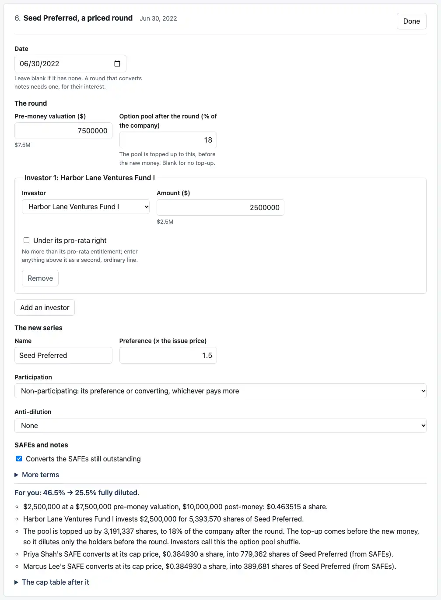
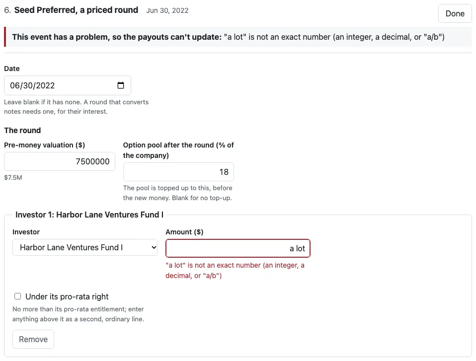
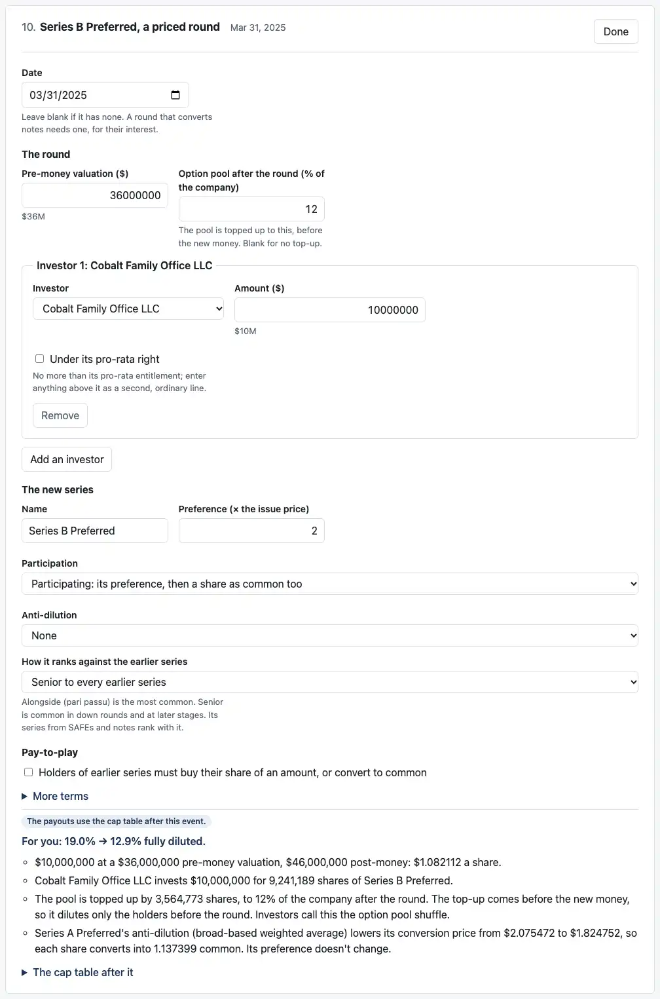

# Review: M4j (editing the rounds)

Branch `m4j-rounds-editor`. As agreed, M4j is the first half of the old M4j: **editing the events a company already has.** Adding, removing and reordering events, a blank company built from its rounds, the phone and keyboard pass, and `review-m4.md` follow in M4k.

**Your three Rounds-tab changes:**
- **A "For you" line** on each card that changes your fully diluted share. For Ana at the Seed: "For you: 46.5% → 25.5% fully diluted."
- **"Investors call this the option pool shuffle."**
- **US dates:** "Feb 1, 2021".

**R28 in the engine:** a round's seniority may leave out its "(from SAFEs)" and "(from notes)" series, which then rank alongside its new series.

**The editor.** On the Rounds tab, each event has "Edit":
- **Fields:** every field of every event type.
- **Lines:** investors, grants, SAFEs and notes can be added and removed.
- **Holders:** a card below the events, where holders are added and renamed.
- **Updates:** every change goes straight to the payouts.



## Run it

```bash
pnpm install && pnpm dev
```

## What to check by behavior

1. **"For you"** (Rounds tab, as Ana):
   - The cards read 0.0% → 55.0%, 55.0% → 51.7%, 51.7% → 46.5%, 46.5% → 25.5%, 25.5% → 19.0% and 19.0% → 12.9%.
   - The two grant events and the SAFE event have no line: grants come out of the pool, and SAFEs aren't shares until they convert.
   - Choose Cobalt on the Payouts tab and only the Series B card has a line: 0.0% → 21.7%.
2. **Open the Seed** ("Edit" on card 6):
   - **Change the pre-money valuation to 7M.** The card says "$2,500,000 at a $7,000,000 pre-money valuation, $9,500,000 post-money", the payouts follow, and the label says "Not saved".
   - **Try 10M instead.** The engine refuses at the Series A: a higher Seed price shrinks Harbor Lane's pro-rata entitlement below the $3,000,000 it takes there. The Series A card names the problem, and the payouts stay on the last rounds that built.
3. **Type "a lot" as the Seed's amount.** The message appears under the field, in red, and at the top of the event. The Payouts tab says "Your last change to the rounds has a problem", and its "Fix it" brings you back to the field. Save is refused until it's fixed.

   
4. **The SAFEs** (card 3):
   - Discounts show as percentages: Priya's is 0.
   - Type 6.5 and save: the file has `"discount": "0.065"`, and every other field exactly as it was.
5. **Lines:** "Add an investor" on the Series A adds "Investor 3", and Remove takes it out again.
6. **Holders** (the card below the events):
   - "Add a holder", rename them, then name them as an investor in a round.
   - A holder named in an event has its Remove button off, with "Named in 2 events, so it can't be removed until it's taken out of them."
   - In the saved file, a new holder gets an id from their name, such as `bea_novak`.
7. **How a round ranks.** Open the Series A:
   - Its control reads "Senior to every earlier series", Millrace as written.
   - Choose "Alongside Seed Preferred and the rest of its tier (pari passu)". The file's Series A seniority becomes `[["series_a", "seed", "seed_shadow"]]`, and the payouts follow.
   - The Seed, the first round, has no control, since there's nothing earlier to rank against.

   
8. **Pay-to-play** (Series B):
   - Tick it. Series A, the most senior earlier series, is named to start with.
   - Offer $1M at 0.1 common per share. The card says "Pay-to-play: $1,000,000 is offered to the holders of Series A Preferred…", and the holders who don't buy convert.
9. **On a phone,** every form fits. I opened all ten forms at once, with "More terms" and pay-to-play open, in headless Chrome at 375 and 320 pixels, and nothing runs off the screen.

   [The Seed's form on a phone](screenshots/m4j-phone.webp)

## What the tests check

**Engine: 3 new tests, 625 in all** (R28):
- Millrace's Seed and case 21's Series A build the same cap tables with their conversion series left out.
- A series from SAFEs listed in a tier of its own stays there.
- Leaving out the round's new series, or an earlier series, is still refused.

**Dashboard: 44 new tests, 162 in all.**

`test/rounds-draft.test.ts` (33):
- **All 26 locked round cases** load into the editor and build back exactly as written.
- **Discounts and interest rates** are held as percentages.
- **Percentages become exact fractions:** "6.5" → "0.065", and "30.000000000000001" keeps every digit.
- **Typed amounts, share counts, percentages and multiples** become the engine's numbers: "$7.5M" → "7500000", "5,500,000" → "5500000", "18%" → "18", "1x" → "1".
- **A blank field** is left out.
- **New holders** get ids from their names.
- **An engine error** finds its event and field, or keeps its path when it names none.

`test/rounds-editor.test.tsx` (11), clicked through:
- opening and closing an event
- percentages on screen
- a change reaching the payouts, checked against the engine run independently on the changed case files
- the refusal caught at a later round
- the message next to the field, Save refused, and "Fix it" back to the field
- a percentage saved as a fraction, with every other field untouched
- adding and removing an investor
- holders
- seniority
- pay-to-play
- a save that builds the same cap tables as the case

`test/rounds.test.tsx`, 1 more: the "For you" lines, for Ana and for Cobalt.

## What changed

- **Engine `rounds.ts`:** R28 in `readSeniority`. `docs/ASSUMPTIONS.md` gains R28, confirmed in your M4j plan answers, and the engine README's input table mentions it.
- **`apps/dashboard/src/roundsDraft.ts`** (new): the rounds as typed, building them back, and where an engine error belongs.
- **`apps/dashboard/src/RoundsEditor.tsx`** (new): the holders card and every event's form.
- **`apps/dashboard/src/fields.tsx`** (new): the editors' fields, moved out of `CapTableEditor.tsx` and joined by a select and a checkbox. The cap table editor uses the same ones.
- **`RoundsView.tsx`:** Edit and Done, the forms, problems, and the "For you" line.
- **`App.tsx`:** a session keeps the rounds as typed, the last rounds the engine built, and any problem. "Fix it" opens the event at the field. You stay the same holder as the cap table is rebuilt.
- **`rounds.ts`** (dashboard): US dates and the option pool shuffle. The rounds are now checked apart from the range, so a range problem stays next to the range field.
- **`file.ts`:** a rounds file with a bad range says so.
- **`scripts/screenshots.mjs`:** five new shots (218 KB).
- **`notes/design-m3.md`:** the editor.

## CI and permissions

- **No changes** to `.github/workflows/` or `.claude/`.
- **No changes** to `cases/`.

## Assumptions added

- **R28,** as you agreed: confirmed.

## Decisions I made, for you to check

1. **"Alongside"** puts the round's new series in the same tier as the most senior earlier series, and leaves the earlier series' order unchanged. With stacked earlier series, it doesn't merge them into one tier. The option names the series: "Alongside Seed Preferred and the rest of its tier (pari passu)". A seniority that's neither option, from a file, shows as "As written: …" until someone chooses.
2. **Changing a series' anti-dilution method** drops any definition of A written for the old one (C10's `anti_dilution_a`, which is optional).
3. **New lines start blank:**
   - The engine names whatever is still missing.
   - The holder is the first one listed.
   - A new note starts with simple interest, a pre-money cap divided by the shares and pool, its event's date, and a 1× repayment at a sale. The note's repayment matters only at a sale, which M5 adds.
   - New SAFEs and notes get ids from their event, such as `pre_seed_safes_1`.
4. **The Class field** on a share issue renames the class only where that event first creates it. Later issues of the same class keep the first name, as the engine reads them.
5. **The Edit buttons** are named for their event for screen readers ("Edit Seed Preferred, a priced round"), and the screen shows "Edit".

## Open questions

None.

Next is M4k: adding, removing and reordering events; "A blank company, built from its rounds" in Start from (a new round's series defaulting to alongside, as you asked); choosing which event the payouts use; the phone and keyboard pass; and `review-m4.md`. I'm stopping here.
