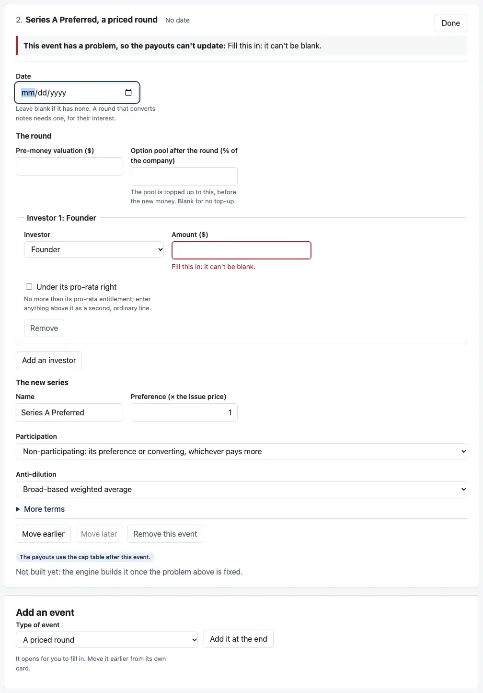
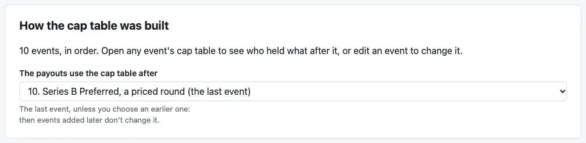

# Review: M4k (building a company's history)

Branch `m4k-rounds-events`, M4's last PR. On the Rounds tab you can now:
- **add an event** of any type
- **move an event** earlier or later
- **remove an event,** after the page asks
- **choose which event's cap table the payouts use**
- **start from "A blank company, built from its rounds"**

With the phone and keyboard pass, the M4 dashboard is complete. **`notes/review-m4.md` covers M4 as a whole.**



## Run it

```bash
pnpm install && pnpm dev
```

## The acceptance test you asked for

**Build the engine README's rounds example by hand, from a blank company.** A click-through test does exactly this (`apps/dashboard/test/acceptance.test.tsx`), and it passes. To do it yourself:

1. **Start from:** "A blank company, built from its rounds". The label reads "Your own company, built from its 1 event".
2. **Rounds tab → Holders** (below the events):
   - rename "Founder" to "Ana (founder)"
   - "Add a holder" twice, named "Seed Fund" and "Series A Fund"
3. **Event 1, "Common Stock issued":** Edit, then set Ana's shares to 9,000,000.
4. **Add an event → "An option pool"** → "Add it at the end". Percent: 10.
5. **Add "SAFEs".**
   - Holder: Seed Fund
   - Amount: 1M
   - Cap: "A post-money valuation cap", already chosen
   - Valuation cap: 10M
6. **Add "A priced round".** It starts as Series A Preferred, 1x non-participating, broad-based anti-dilution: the README's terms.
   - Pre-money valuation: 20M
   - Option pool after the round: 10
   - Investor 1: Series A Fund, 5M

**What you should see.** The Series A card reads:
- "$5,000,000 at a $20,000,000 pre-money valuation, $25,000,000 post-money: **$1.730769** a share."
- "Seed Fund's SAFE converts at its cap price, **$0.900000** a share, into **1,111,111** shares of Series A Preferred (from SAFEs)."
- "Series A Fund invests $5,000,000 for 2,888,888 shares of Series A Preferred."

The Payouts tab lists **three breakpoints, $5,999,998, $14,099,998 and $22,499,998**, with the README's three reasons word for word.

**The test also checks, from the saved file, to the cent:**
- **The breakpoints:** $5,999,998.36, $14,099,998.36 and $22,499,998.27.
- **The payouts at $20M:** Ana $13,351,649.87, Seed Fund $1,648,351.67, Series A Fund $4,999,998.46.
- **The payouts at $60M:** $41,538,464.73, $5,128,205.01 and $13,333,330.26.

These are the README's numbers. The README's own test checks they're what the engine prints for its example.

## What else to check by behavior

1. **Adding:**
   - **A new event** opens at its Date field, with its fields blank.
   - **The engine names the first blank field:** "Fill this in: it can't be blank."
   - **The card** says "Not built yet: the engine builds it once the problem above is fixed."
   - **The payouts** stay on the last rounds that built.
2. **Moving.** On Millrace, open the third "Options granted" (event 9) and click "Move later":
   - It becomes event 10, after the Series B.
   - The payouts follow the last event, now the grants, and change: the Series B's pool top-up is larger with the grants before it.
   - Moving the Seed's grants (event 7) before the Seed is refused there: "A grant of 1,100,000 options is more than the 692,033 left in the unissued pool".
3. **Removing.** "Remove this event" on Lena's 6% (event 2) asks "Remove event 2, Common Stock issued? What it did goes, and the events after it are built again without it." The last event left can't be removed.
4. **The payouts' event.** At the top of the tab, "The payouts use the cap table after" lists the events, with the last marked "(the last event)".
   - **Choose 8, the Series A:** the payouts move to that cap table.
   - **An event added later** doesn't change that choice.
   - **Left on the last event,** the choice follows the last event as events are added or moved.

   
5. **Keyboard:**
   - after adding, focus is on the new event's Date
   - after removing, on "Type of event"
   - after moving, on the same move button, or "Move earlier" once the event is last
   - everything else uses the browser's own buttons, selects and disclosures
6. **Phones.** I measured in headless Chrome at 375 and 320 pixels: Millrace with all ten events open, a blank company with one of every event type added and open, and every tab. Nothing runs off the screen.

## What the tests check

**7 new dashboard tests, 169 in all:**
- **The acceptance test.**
- **A blank company:** one event, which can't be removed.
- **Adding:** all seven types, the plain message for a blank field, "Not built yet", and focus on the new event.
- **Moving:** an event moved later, with the payouts checked against the engine run independently on the reordered case files, and focus kept on the button.
- **A refused move:** the Seed's grants before the Seed.
- **Removing:** after asking, with focus on "Type of event", and the payouts checked against the engine.
- **The payouts' event:** an earlier one chosen and kept as events are added.

**Engine: 625 tests, unchanged in number.**

## What changed

- **`apps/dashboard/src/roundsDraft.ts`:**
  - adding, removing and moving events, with the payouts' event following the last unless chosen
  - a new event's starting fields
  - the blank company
  - each event's title before it's built
  - the plain message for a blank field
- **`RoundsView.tsx`:**
  - the list is the events as typed
  - what each did is matched to it by id, from the last rounds the engine built
  - the payouts' event choice, the move and remove buttons, the "Add an event" card, and focus handling
- **`App.tsx`:** "A blank company, built from its rounds" in Start from.
- **Engine `rounds.ts`:** the grant message groups its digits ("1,100,000"), since founders now read it on the page.
- **Root `README.md`:** the page now builds a cap table from its rounds, and the list of what it doesn't handle says so.
- **`notes/design-m3.md`:** M4k's parts.
- **`scripts/screenshots.mjs`:** two new shots (49 KB).

## CI and permissions

- **No changes** to `.github/workflows/` or `.claude/`.
- **No changes** to `cases/`.

## Assumptions added

None.

## Decisions I made, for you to check

1. **New events go at the end,** and "Move earlier" puts them where they belong. A company's history is mostly written in order, and this keeps each card's controls in the card.
2. **A new event's starting fields:**
   - Blank: the date, amounts, prices and percentages.
   - The first holder listed.
   - The common class already issued.
   - A new round's series: the next letter (Series A, B, …), 1x non-participating, broad-based weighted-average anti-dilution (SPEC's default), and alongside the most senior earlier series (your M4j answer).
3. **"The payouts use the cap table after"** follows the last event unless you choose an earlier one. If the event you chose is removed, it goes back to following the last.
4. **The engine names one blank field at a time,** the first it reads, as in the cap table editor. Filling it in shows the next.

## Open questions

None.
