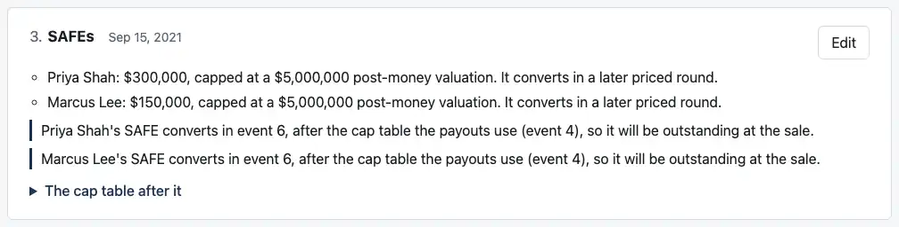
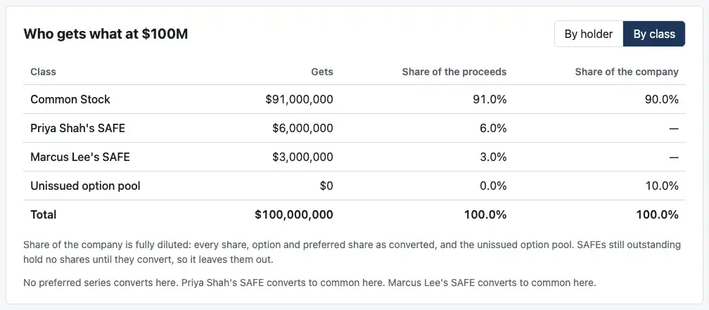
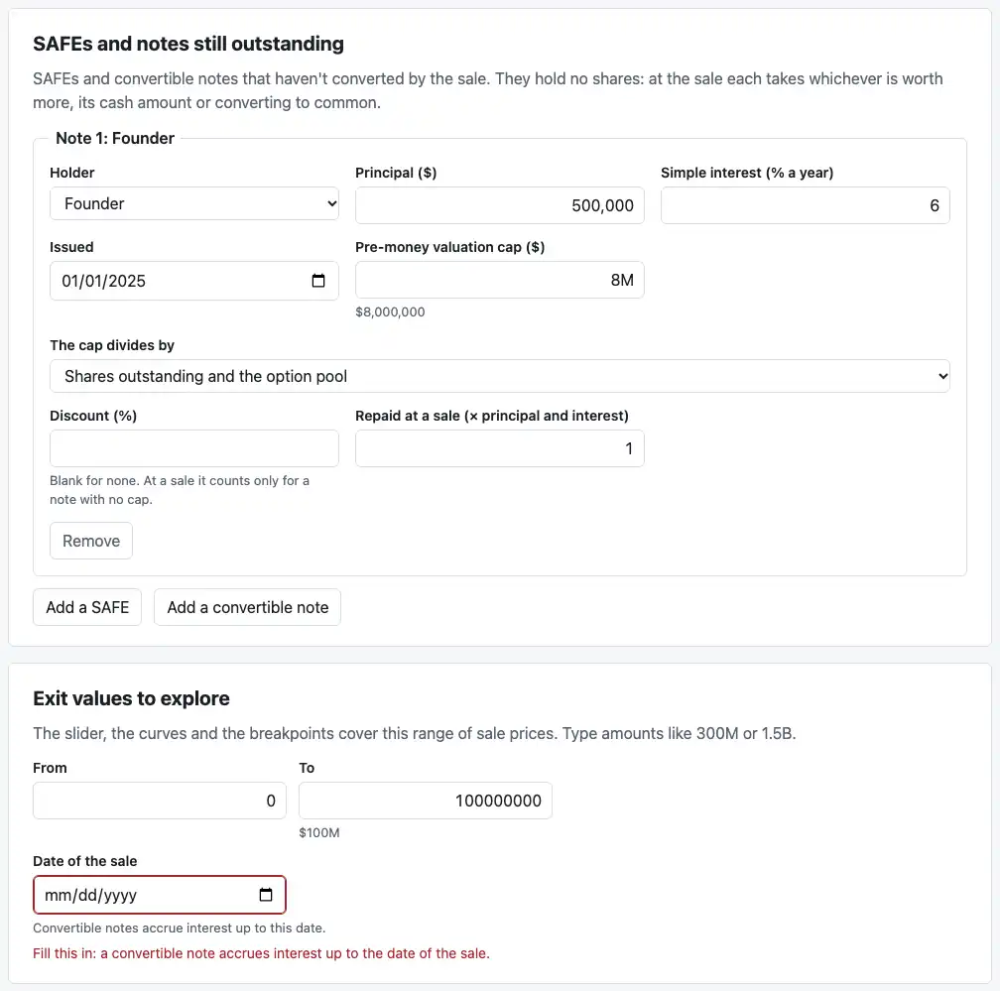
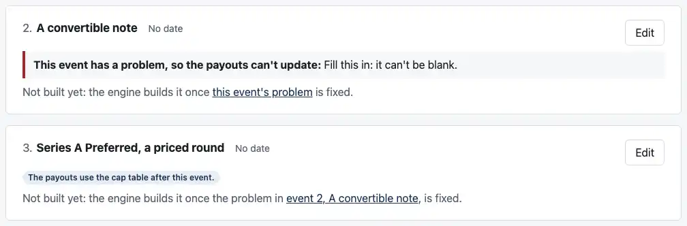

# Review: M5k (SAFEs and notes at a sale, on the page)

Branch `m5k-dashboard-terms`.

**I split M5k three ways,** since all of it wouldn't fit one evening's review (CLAUDE.md):
- **M5k, this PR:** SAFEs and notes still outstanding at a sale, the sale's date their interest needs, and your five rounds-editor items. Those items wait on these terms.
- **M5k2:** cumulative dividends and warrants. They use the same sale date.
- **M5k3:** carve-outs, with your curve items: charts drawn along a curve, and the X17 "For you" wording.

Then M5l, the payments view.

**What the page now does:**
- **SAFEs and notes are no longer refused.** It shows them on the Cap table tab, in the payouts, and on the Rounds tab.
- **It asks for the sale's date** when a note needs it.
- **Saved files** are version 3: they carry the date.

## How to check it by behavior

### 1. Founder, note, round, from a blank company

This is the click-through you asked for, in `test/acceptance.test.tsx`. Start from "A blank company, built from its rounds" and open the Rounds tab. Leave "The payouts use the cap table after" alone throughout.

1. **Holders:** rename Founder to Ana, and add Nadia and Fund.
2. **Add "Convertible notes",** dated Jan 1, 2025. Fill in Nadia, $500,000, 6%, issued Jan 1, 2025, an $8M pre-money cap and a 20% discount.
   - The payouts follow the last event, so the note's card says: "Nadia's convertible note isn't converted by any later round, so it will be outstanding at the sale."
   - The Payouts tab says the cap table has a problem: "Fill this in: a convertible note accrues interest up to the date of the sale." **Fix it** goes to "Date of the sale" on the Cap table tab.
3. **Type Jan 1, 2026.** At $50M, Nadia's note converts at its cap:
   - **Interest:** a year at 6% on $500,000 is $30,000, so $530,000 converts.
   - **Price and shares:** $8M ÷ 10,000,000 shares is $0.80, so it converts into 662,500 shares.
   - **Payouts:** Nadia gets 662,500 ÷ 10,662,500 × $50M = **$3,106,682.30**, and Ana **$46,893,317.70**.
   - **By class,** the table has a row for "Nadia's convertible note". The line under the table says it "converts to common here".
4. **Add "A priced round".** "Converts the convertible notes still outstanding" starts **ticked**. Fill in Jan 1, 2026, a $20M pre-money valuation, and Fund investing $5M.
   - **On the round's card:** "Nadia's note converts $530,000.00 ($500,000 and $30,000.00 interest) at its cap price, $0.800000 a share, into 662,500 shares of Series A Preferred (from notes)."
   - **The payouts move to the round by themselves.** Its card says "The payouts use the cap table after this event", and the note's card no longer says it's outstanding.
   - **At $50M:** the round prices at $20M ÷ 10,662,500 shares, so Fund's $5M buys 2,665,625 shares, 20% of 13,328,125. At $50M everyone converts: Fund gets **$10,000,000**, Nadia **$2,485,345.84**, and Ana **$37,514,654.16**.

The test compares each headline with the engine run on the same company, written by hand in the case format, apart from the page.

### 2. Millrace, with the payouts before the Seed

On the Rounds tab, choose "4. Option pool created" under "The payouts use the cap table after". Then look at event 3, the SAFEs:

The Seed converts them, but it comes after the cap table the payouts use, so the page says they'll be outstanding. On the Payouts tab, by class:

At $100M the post-money SAFEs take their fixed shares:
- **Priya:** $300,000 ÷ $5M = 6%, so **$6,000,000**
- **Marcus:** $150,000 ÷ $5M = 3%, so **$3,000,000**

They hold no shares, so "Share of the company" shows a dash, and a footnote says why. Until this PR the page refused this cap table.

### 3. A SAFE or a note, typed in on the Cap table tab

The card "SAFEs and notes still outstanding" comes after "Who holds what":

`test/editor.test.tsx` types in cases 12 and 13a from a blank cap table. That's the two founders, Employee C's options and the pool, then Investor X's SAFE or note. It checks every holder's payout at every listed exit value against the locked `expected.json`. For the note:
- **No date:** the page asks for the sale's date.
- **Dec 31, 2021:** it says that's before the note was issued.

### 4. "Not built yet" names what it's waiting on

From a blank company, add "Convertible notes" and then "A priced round" without filling anything in. Each card names the event it's waiting on and links to that event's problem:

The round still shows "SAFEs and notes", with its box ticked, though the engine can't build the note yet. The page reads which SAFEs and notes are outstanding from the events as typed.

### 5. Every SAFE and note case opens as a file

`test/file.test.ts` opens all 15 cases, 12 to 12h and 13a to 13g, as saved files. 12g opens as its rounds. Each gives the engine exactly the case's cap table and sale date, and the same payouts at every breakpoint. Saving one again writes the same file.

## Your five rounds-editor items

1. **"Converts the convertible notes still outstanding" starts ticked.** A priced round added with "Add an event" is written with `convert_notes: true`. The engine's default doesn't change (C14): a round loaded without the field doesn't convert notes, so its box shows unticked, which is what the engine will do.
2. **The "SAFEs and notes" section** shows whenever an earlier event's SAFE or note is still outstanding just before the round, as typed, even when the draft doesn't build.
3. **"Will be outstanding at the sale"** is said on the SAFE's or note's own event, one line each.
4. **"Not built yet"** names the event it's waiting on, and links to that event's problem. A problem that names no event links to the problem at the top of the list.
5. **The click-through test** is above, in check 1.

## Decisions I made, for you to check

1. **The split** into M5k, M5k2 and M5k3.
2. **Item 2, read slightly narrower than "whenever an earlier event creates a SAFE or note":** the section shows only while one is still outstanding. Millrace's Series A doesn't show it, because the Seed already converted its SAFEs and there's nothing left for the box to do. Unticking a round's box keeps the note outstanding for the next round, which then shows the section.
3. **Item 3 also covers a cap table chosen before the converting round,** as in check 2. Besides "isn't converted by any later round", the page says "converts in event 6, after the cap table the payouts use (event 4)". Either way the SAFE or note is outstanding at the sale.
4. **How the page knows which SAFEs and notes convert:** it reads it from the events as typed, using the engine's rule. A round converts the SAFEs still outstanding unless it says not to, and the notes only when it says so. A test checks that this matches what the engine builds, after every event, in every round case (`test/rounds-draft.test.ts`).
5. **The sale's date has no default.** The field shows once there's a note, or once a date is set, and the page asks for it rather than assume today. In M5k2 dividends will use it too.
6. **Files are version 3.** It adds `exit_date`, written only when given, and a version 2 file opens as it was (C13). A file needs a new version so an older page refuses it as newer, with a plain reason, instead of naming an unknown field.
7. **A SAFE or note holds no shares,** so "Share of the company" leaves it out:
   - **By class,** its row shows a dash.
   - **By holder,** its holder's share counts only the shares they hold.
   - **On the Payouts tab,** a footnote says so. A SAFE or note holder viewing as "you" also gets a sentence saying so.
8. **Names:** a SAFE or note is named as the engine's reasons name it: "Priya Shah's SAFE". A holder with two of a kind has each told apart by its amount.
9. **A blank field on the Cap table tab** now says "Fill this in: it can't be blank.", as the rounds editor does, instead of `"" is not an exact number`. That also changes the message for a blank price or range, which said the latter before.
10. **The SAFE's ranking:** "Its cash amount is paid alongside" offers the most junior preferred (the default, X9) or a named series. It appears only when there's preferred. A SAFE in a rounds event keeps a ranking written in the file, and the Cap table tab shows it, but the rounds editor doesn't offer the choice yet.

## What changed

- **The page** (`apps/dashboard/src/`):
  - **`draft.ts`:**
    - SAFEs, notes and the sale's date in the draft
    - the page's refusal list without them
    - where their messages go
    - the "Fill this in" wording
  - **`CapTableEditor.tsx`:** the new card, and "Date of the sale" on the range card.
  - **Payouts:** `PayoutTable.tsx`, `FounderView.tsx`, `PayoffChart.tsx` and `capTable.ts` name SAFEs and notes and give them their own classes.
  - **The Rounds tab:**
    - **`roundsDraft.ts`:** what's outstanding, from the events as typed, and `convert_notes: true` on a new round
    - **`RoundsEditor.tsx`:** the section
    - **`RoundsView.tsx`:** the at-sale lines and the "Not built yet" link
  - **`rounds.ts`:** the date passes through, and a SAFE's `cash_out_ranks_with` is no longer dropped from a table built from rounds.
  - **The sale's date reaches the engine** in `file.ts` (version 3), `analysis.ts` and `App.tsx`.
- **Engine:** one comment in `src/input.ts`, which still said notes were refused at exit. No behavior changes, and nothing to publish.
- **Tests:** 61 more dashboard tests (243). The tests that expected these terms to be refused now expect them to open.
- **Docs:**
  - **`docs/ASSUMPTIONS.md`:** C13 (version 3, and SAFEs and notes shown) and C14 (a new round's `convert_notes`).
  - **The root README:** what the page shows.
- **`scripts/screenshots.mjs`:** four M5k shots, 84 KB, and a longer wait for Chrome to start.

## Checks

- **Engine:** 1,302 tests pass.
- **Dashboard:** 243 tests pass, 61 more than after M5j.
- **Reference:** 47 unit tests pass, and all 61 cases match.
- **`cases/`:** no changes.
- **Typecheck and build:** clean.

## CI and permissions

- **No changes** to `.github/workflows/` or `.claude/`.

## Assumptions added

**No new IDs.** Updates:
- **C13:** file version 3, and SAFEs and notes shown on the page.
- **C14:** the page starts a new priced round converting the notes still outstanding.

## Open questions

None. M5k2, dividends and warrants on the page, is next. I'm stopping here.
