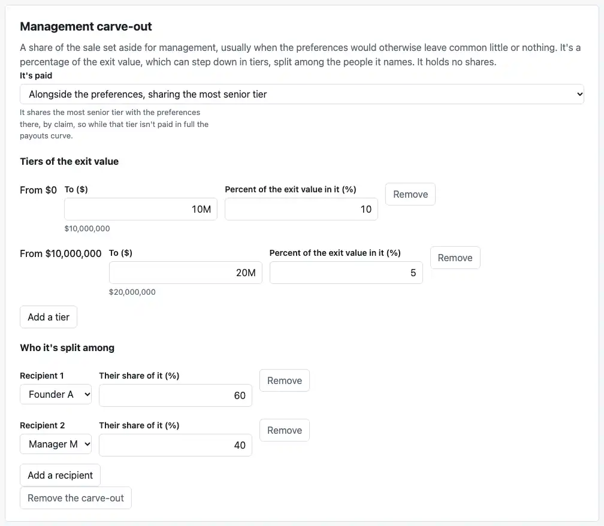
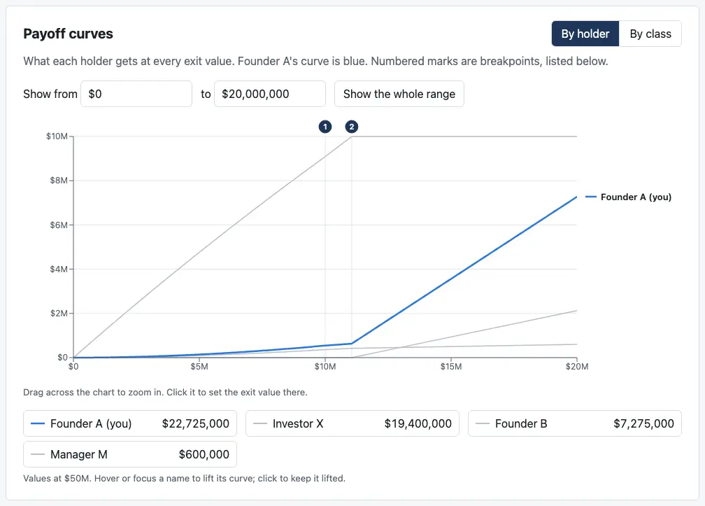
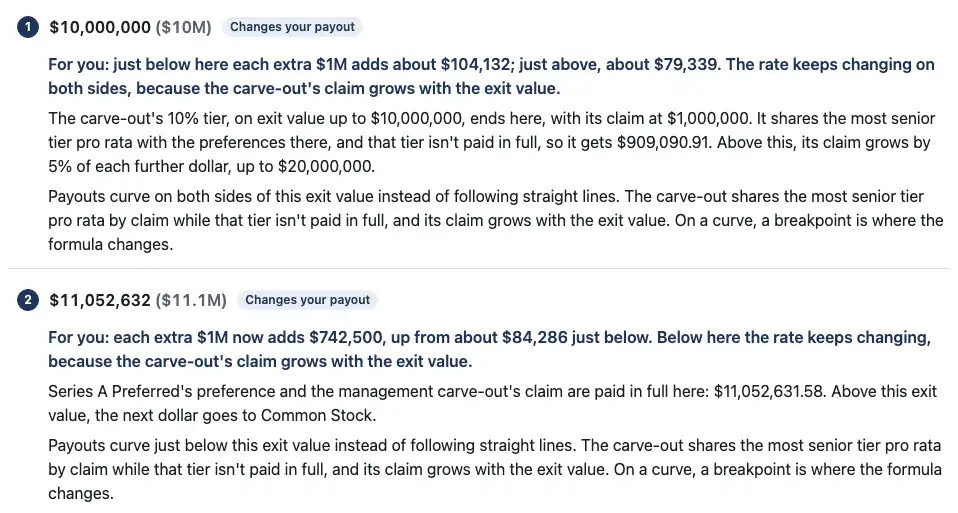

# Review: M5k3 (carve-outs and curved payouts, on the page)

Branch `m5k3-carve-outs-curves`. The page now shows a management carve-out, and follows the curves a carve-out alongside the preferences makes (X17):
- **Charts** draw each curved stretch through points along it.
- **The legend and the hover readout** read values on a curve from the engine, exactly.
- **The "For you" line** uses the wording you approved in the M5d review.

**A cap table now has nothing the page refuses.** What's left is escrow and earnouts, which belong to the exit. They come with the payments view in M5l.

## How to check it by behavior

### 1. Case 10b, typed in on the Cap table tab

Start from a blank cap table:
- **Holders:** Founder A, Founder B, Investor X and Manager M.
- **Series A:** 4,000,000 shares at $2.50.
- **Common:** Founder A 4,500,000, Founder B 1,500,000.
- **Range:** to $50M.

Then "Add a carve-out" on the new card:

- **It's paid:** "Alongside the preferences, sharing the most senior tier".
- **Tiers:** to $10M at 10%; then "Add a tier", to $20M at 5%. Each tier starts where the one before ends, so you type only where it ends.
- **Recipients:** Founder A 60%. Until Manager M's 40% is in, the page says "The recipients' percentages add up to 60, not 100".

`test/editor.test.tsx` does exactly this, then checks every holder's payout at all ten of the locked case's listed exit values, the curved ones included. At $50M, for example:
- **The carve-out:** $1M from the first tier and $500,000 from the second, $1.5M in all. Founder A gets $900,000 of it, and Manager M $600,000.
- **Series A:** 40% of the $48.5M left is $19.4M, more than its $10M preference, so it converts.
- **Founder A:** 45% of $48.5M plus the $900,000, **$22,725,000**.

### 2. The curves and the "For you" line

On the Payouts tab, show from $0 to $20M:

From $0 to $11,052,631.58, the carve-out shares the Series A tier, which isn't paid in full, so payouts curve. The chart draws each curved stretch through 64 of the engine's own payouts.

The breakpoint list, for Founder A, matches your approved wording word for word:

- **$10M:** "For you: just below here each extra $1M adds about $104,132; just above, about $79,339. The rate keeps changing on both sides, because the carve-out's claim grows with the exit value."
- **$11,052,631.58:** "For you: each extra $1M now adds $742,500, up from about $84,286 just below. Below here the rate keeps changing, because the carve-out's claim grows with the exit value."

`test/curves-ui.test.tsx` opens 10b as a file and checks both lines exactly. On a curved side the rate is read right at the breakpoint, across a step of 10^-9, as the engine reads its slopes.

### 3. Exact values on a curve

Type an exit value of $78,125: midway to the first point the curve is drawn through, where the curve bends most. There, the straight line between the two points is $36.54 off the curve: under a pixel on the chart, but not to the cent. So on a curved stretch the legend and the hover readout ask the engine. The test checks Founder A's and Manager M's legend values against the engine at $78,125.

### 4. The carve-out in the payouts

By class, the table and the curves have a "Management carve-out" class:
- **Share of the company:** a dash, with a footnote: it holds no shares.
- **A recipient** viewing as "you" is told their share of it isn't counted in their share of the company.

### 5. Files

Cases 10 and 10b open as saved files and give the engine exactly the case's cap table, with the same payouts at every breakpoint. Saving one again writes the same file.

## Decisions I made, for you to check

1. **The "For you" wording when only the side above curves.** No case has one, and you approved the both-sides and below-only versions. By symmetry: "For you: just above here each extra $1M adds about $X, down from $Y. Above here the rate keeps changing, because the carve-out's claim grows with the exit value." It's recorded in X17 for you to check.
2. **64 points per curved stretch**, as many as the engine checks a stretch at. They're for drawing only: every value the page shows on a curve comes from the engine.
3. **A tier starts where the one before ends** (C6), so its start isn't typed. A message about where a tier starts goes to the end of the tier before it.
4. **A new carve-out** is paid before all preferences (the C6 default), with one tier and no upper end, all to the first holder at 100%.
5. **Removing a holder who's a recipient** removes their share. The page asks first: "Its share of the carve-out goes too." The engine then says the shares no longer add to 100%. They're never shared out again quietly.
6. **"It's paid" hint:** alongside the preferences, the card says payouts curve while that tier isn't paid in full.
7. **Rounds:** a carve-out isn't a round event, so it comes only on a cap table entered directly. A cap table built from rounds is read-only here, as before.

## What changed

- **The page** (`apps/dashboard/src/`):
  - **`draft.ts`:** the carve-out in the draft, its fields and messages, and the page's refusal list now empty.
  - **`CapTableEditor.tsx`:** the "Management carve-out" card.
  - **Payouts:** `PayoutTable.tsx`, `PayoffChart.tsx`, `FounderView.tsx` and `capTable.ts` show the carve-out as a class of its own, holding no shares.
  - **`analysis.ts`:**
    - each breakpoint's curve flags, and its rates on a curved side
    - points along each curved stretch
  - **`curves.ts`:** sample points, where a curve is, and the rates on curved sides.
  - **`BreakpointList.tsx`:** the X17 wording.
  - **`PayoffChart.tsx`:** exact values on a curve.
- **Tests:** 15 more on the page (275). The tests that expected a carve-out to be refused now expect it to open.
- **Docs:**
  - **`docs/ASSUMPTIONS.md`:** X17 (on the page now, and the curved-above wording for you to check) and C13 (a cap table has nothing left the page refuses).
  - **The root README:** what the page shows.
- **`scripts/screenshots.mjs`:** three M5k3 shots, typed in from a blank cap table, 105 KB.

## Checks

- **Engine:** 1,304 tests pass, unchanged.
- **Dashboard:** 275 tests pass.
- **Reference:** 47 unit tests pass, and all 61 cases match.
- **`cases/`:** no changes.
- **Typecheck and build:** clean.

## CI and permissions

- **No changes** to `.github/workflows/` or `.claude/`.
- **Outside the sandbox:** only `pnpm screenshots`, under your standing permission.

## Assumptions added

**No new IDs.** Updates:
- **X17:** the page's curves, and the curved-above wording.
- **C13:** what the page refuses.

## Open questions

1. **The curved-above wording**, decision 1: is the symmetric version right?

Otherwise M5l, the payments view, is next. It ends M5, with `review-m5.md`. I'm stopping here.
