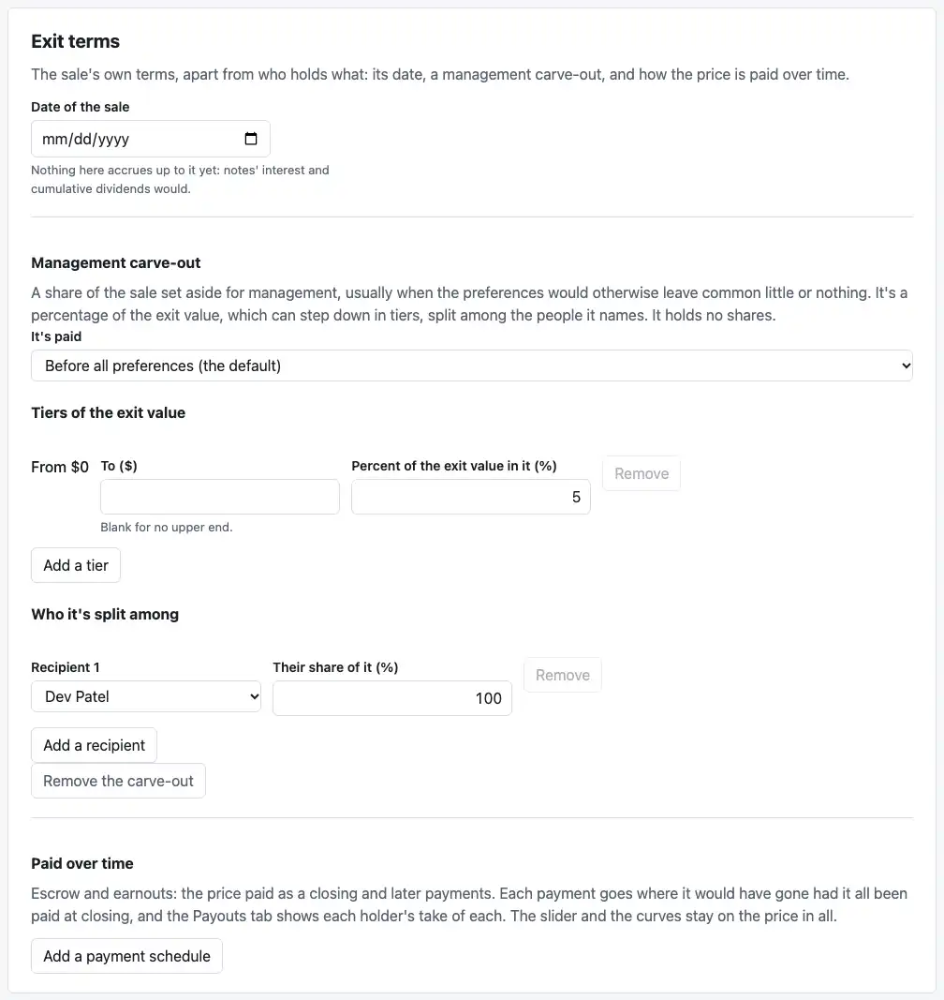
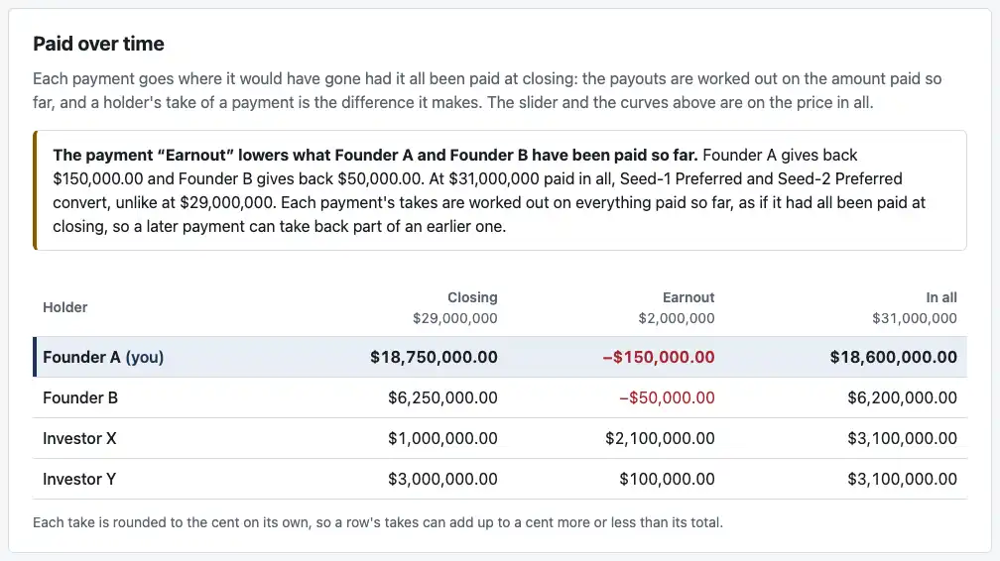
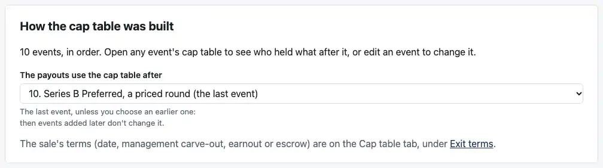

# Review: M5l (Exit terms, and the payments view)

Branch `m5l-exit-terms-payments`. M5's last PR:
- **The "Exit terms" card** on the Cap table tab, as the M5 plan agreed (item 13). It holds the sale's date, a management carve-out and payment schedules, and it's editable whether the cap table was entered directly or built from rounds.
- **"Paid over time"** on the Payouts tab (item 14), with X8's warning on a payment that lowers a running total.
- **Your mid-PR request:** a line on the Rounds tab that points to the sale's terms and links to the card.

**The page now refuses nothing the engine pays.** `notes/review-m5.md`, the review of M5 as a whole, comes with this PR.

## Your two points from M5k3

1. **The curve-above wording, "up from" or "down from":** the code already said "up from" or "down from" by which way the rate moves; my example showed only "down". X17 now records it as confirmed, and a new test covers "up from".
2. **The Exit terms card:** below.

## How to check it by behavior

### 1. A carve-out on Millrace, built from its rounds

Open Millrace, which is built from its ten events, and go to the Cap table tab. The cap table is still locked, but the Exit terms card isn't:

1. **"Add a carve-out":** 5% of the exit value, no upper end, all to Dev Patel.
2. **At $100M,** the Payouts tab's headline for Ana goes from $9.75M to **$9.02M**:
   - **Ana:** $9,015,859.35, against $9,750,989.67 without the carve-out.
   - **Dev:** $12,681,423.98: the carve-out's $5,000,000, plus $7,681,423.98 of the $95,000,000 left.
3. **Change the rounds,** say Series B's investment to $12M: the cap table is built again and the carve-out stays, still Dev's. Ana's headline is the engine's, now **$7,968,470.23**.
4. **Save:** the file keeps the carve-out beside the events (`carve_out`), and opening it gives the same payouts.

`test/exit-terms.test.tsx` does all of this, the test you asked for. It compares each headline with the engine running Millrace's own events, with the carve-out added to the cap table the engine builds, apart from the page.

### 2. Paid over time, and X8's warning

Type in case 6b's company, then under Exit terms "Add a payment schedule": a $29M closing and a $2M earnout. The card shows "In all, $31,000,000." On the Payouts tab:

The figures are the ones you checked in M5i:
- **Founder A:** −$150,000.00.
- **Founder B:** −$50,000.00.
- **Investor X:** +$2,100,000.00.
- **Investor Y:** +$100,000.00.

**The warning sits on the payment itself.** It says who gives back what, and why: "At $31,000,000 paid in all, Seed-1 Preferred and Seed-2 Preferred convert, unlike at $29,000,000." The negative takes are red, with a true minus sign, and a screen reader hears "lowers the running total". The test checks the warning word for word, and every cell.

### 3. Case 11's two schedules

Open case 11 as a file. "Paid over time" shows both of its schedules, titled by their descriptions. The test checks every holder's take of every payment against the locked `expected.json`, to the cent. Neither schedule lowers a running total, so there's no warning.

### 4. The Rounds tab points to the sale's terms

"The sale's terms (date, management carve-out, earnout or escrow) are on the Cap table tab, under Exit terms." The link opens the Cap table tab with the Exit terms card focused.

### 5. Files

Saved files are **version 4**:
- **Payment schedules** are saved as `payment_schedules`.
- **A cap table built from rounds** keeps its carve-out beside the events. One entered directly keeps it in its cap table (C6); a file with one beside it is refused, with a plain reason.
- **Older files:** a version 3 file opens as it was.
- **Case 11** opens with exactly its schedules.

## Decisions I made, for you to check

1. **The engine reads a carve-out only as part of a cap table.** For a company built from rounds, the page adds it to the cap table the rounds build, and the file keeps it beside the events. An exit in the case format can't carry one on a cap table named by event yet. If you want the engine to take a carve-out as an exit term (`exit.carve_out`), that's an engine change for 0.3.0; it's the open question below.
2. **The sale's terms are carried across every rebuild of the rounds, as typed.** Recipients are matched by id. One the rounds no longer have is left blank, for the engine to ask for, never given to someone else.
3. **The sale's date is now always shown** under Exit terms, with a hint saying what accrues to it. It used to appear only once there was a note or dividends.
4. **No default sale date.** The M5 plan (item 10) said new tables would default it to today. In M5k I asked for it instead, and you approved that, so it stays.
5. **More than one schedule.** Each schedule is one way the sale could be paid; case 11 has two. A new schedule starts as "Closing" and "Earnout", amounts blank, and the card totals each schedule's payments.
6. **The takes table:**
   - **Rows:** holders with a take.
   - **Columns:** each payment, then "In all".
   - **Rounding:** each take to the cent on its own, as X8 says, with a footnote that a row can differ from its total by a cent.
7. **The screenshot script's recipe for typing in case 6b** found fields by position. M5k2's dividends checkbox had shifted them, so it now finds them by id. That's the only change to the script besides the new shots.

## What changed

- **The page** (`apps/dashboard/src/`):
  - **`CapTableEditor.tsx`:** the Exit terms card. The carve-out moved into it from its own card, and the date from the range card.
  - **`draft.ts`:** payment schedules in the draft, `carryExitTerms`, and where their messages go.
  - **`rounds.ts`:** the sale's terms, from a file or an example, onto the cap table the rounds build.
  - **`file.ts`:** version 4.
  - **`App.tsx`:** carries the terms across a rebuild, shows Paid over time, and links the Rounds tab to the card.
  - **`PaymentsView.tsx`** (new): Paid over time, and the warning.
  - **`RoundsView.tsx`:** the line pointing to Exit terms.
  - **`styles.css`:** the card's parts, and the takes table.
- **Engine:** no changes.
- **Tests:** 13 more on the page (288), with a new file, `test/exit-terms.test.tsx`.
- **Docs:**
  - **`docs/ASSUMPTIONS.md`:**
    - **X17:** the curve-above wording, confirmed.
    - **X8:** the payment view, built.
    - **C6:** a carve-out on a company built from rounds.
    - **C7:** schedules on the page.
    - **C13:** version 4, and nothing left refused.
  - **The root README:** what the page shows.
- **`scripts/screenshots.mjs`:** three M5l shots, 88 KB, and the case 6b recipe fixed.

## Checks

- **Engine:** 1,304 tests pass.
- **Dashboard:** 288 tests pass.
- **Reference:** 47 unit tests pass, and all 61 cases match.
- **`cases/`:** no changes.
- **Typecheck and build:** clean.

## CI and permissions

- **No changes** to `.github/workflows/` or `.claude/`.
- **Outside the sandbox:** only `pnpm screenshots`, under your standing permission.

## Assumptions added

**No new IDs.** Updates: X17, X8, C6, C7 and C13, as above.

## Open questions

1. **A carve-out as an exit term in the engine** (`exit.carve_out`, decision 1): should 0.3.0 accept one, so an exit on a cap table built from rounds can carry a carve-out in the case format too?

That's M5. `notes/review-m5.md` covers the milestone as a whole. I'm stopping here.
